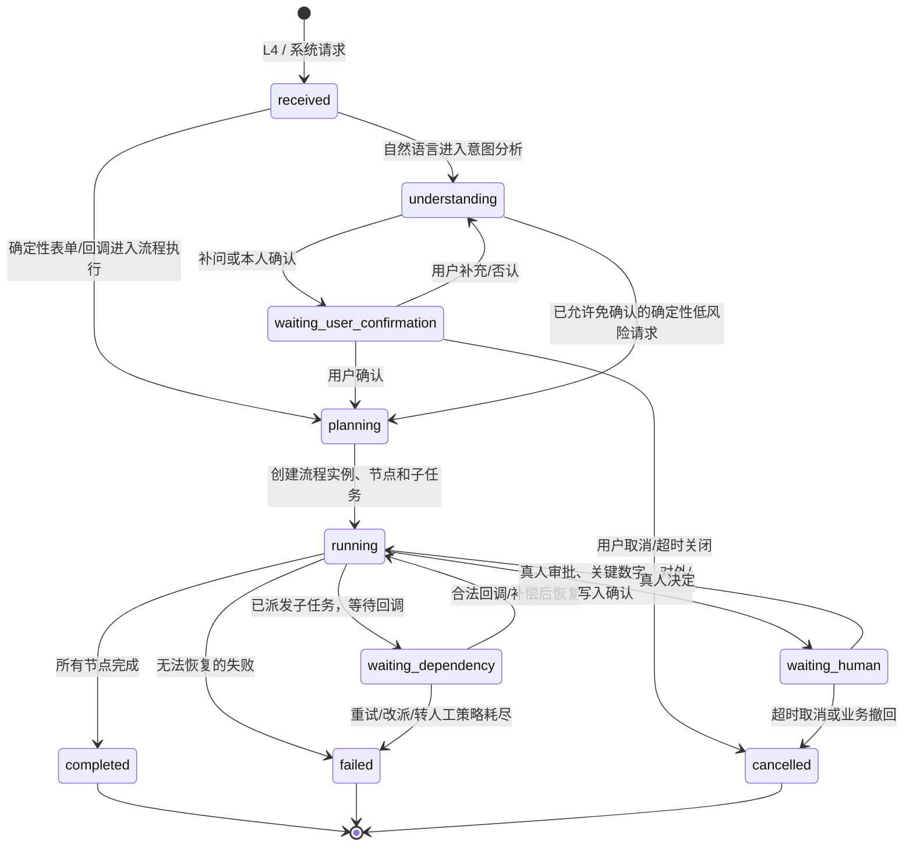

# 完整任务推进与持续运行机制

**版本：** v0.2  
**日期：** 2026-07-16  
**维护方：** 平台架构组  
**最高依据：** 《AI平台架构框架说明 v2.2》《v2.2 架构冲突解决与落地决议 v0.1》  
**配套文件：** 《层接口对内通道设计与模块接入规范 v0.2》《平台层间通信与权限协议 v0.6》。  
**目的：** 规定一次任务从用户发起到完成、失败、取消或等待真人的完整推进机制，防止任务丢失、重复执行、无声停滞或越权推进。

## 1. 先回答核心问题

### 1.1 谁负责推进任务

```text
业务逻辑 / 流程模板：定义“这件事应有哪些步骤、哪些条件、哪些真人关卡”。
意图分析引擎：理解“用户想办什么”，对应能力字典，不负责执行。
流程执行引擎：把任务变成可持久化的流程实例，决定何时派发、等谁、重试、改派、转真人、完成或终止。
执行引擎：只完成被派给自己的一个子任务，回报结果。
对内通道：只负责校验、判权、送件、回传、留痕，不决定下一步业务逻辑。
```

因此，**任务的正常推进核心依靠流程执行引擎，不依靠大模型临场“记住该干什么”，也不依靠某个执行引擎自行往下调用。**

### 1.2 “不会停下”是什么意思

平台不能承诺任何任务一定成功，例如旧系统宕机、用户不确认、权限被拒绝时不应强行继续。正确目标是：

```text
不丢：已受理任务和状态必须持久化。
不重：重复请求、重复派发、重复回调不重复产生业务后果。
不盲等：每个等待都有责任人、截止时间、唤醒条件和下一步策略。
可恢复：服务重启、网络波动、回调丢失后可从持久化状态继续。
可结束：任务最终必须进入 completed / failed / cancelled / waiting_human 等可解释状态。
可追责：任一 trace_id 能查到谁在等谁、为什么没有继续、下一次检查何时发生。
```

`waiting_human`、`waiting_dependency` 不是“卡死”；它们是已登记、可催办、可查询、可恢复的受控等待状态。

### 1.3 确认不是固定动作，而是冻结在命令中的策略

意图分析必须输出 `requires_user_confirmation`。高风险、数据/文件存改、外部写入、审批、资产创建或开放、对外发布以及多义请求必须确认；低风险只读、纯查询和确定性表单可按登记规则免确认。流程执行不能自行降低该要求，执行引擎更不能绕过确认节点。

## 2. 一次任务的总状态机



## 3. 任务、流程、节点和子任务的关系

```text
一个用户请求 request_id
  -> 一个追踪链 trace_id
  -> 零个或一个待确认意图 pending_intent
  -> 一个流程实例 workflow_instance
  -> 多个流程节点 workflow_node
  -> 每个节点零个或多个子任务 dispatch_task
  -> 每个子任务对应一次执行引擎或 L1 异步能力调用
```

| 对象 | 唯一责任方 | 必须持久化的关键内容 | 谁可改变状态 |
| --- | --- | --- | --- |
| `pending_intent` | 意图分析逻辑，L1.6 管生命周期、L1.7 物理存储 | 发起真人、理解版本、确认问题、过期时间、`trace_id` | 意图分析。 |
| `workflow_instance` | 流程执行 | 命令、流程/模板版本、状态、责任真人、`trace_id` | 流程执行。 |
| `workflow_node` | 流程执行 | 能力编号、依赖、状态、输入/输出引用、截止时间 | 流程执行。 |
| `dispatch_task` | 流程执行 | 承办服务、动作、幂等键、尝试次数、租约、回调结果 | 流程执行；执行引擎只能提交回调。 |
| `human_task` | L1.11 人机协同，流程执行关联节点 | 接收岗位/真人、待办、截止时间、决定 | 人机协同记录决定；流程执行推进节点。 |
| `operation_id` | L1.10 系统接口 | 外部写入请求、回执、重试关联 | L1.10 记录外部状态；流程执行决定后续。 |

## 4. 正常推进的十二步

下面以“汇总华南区本月销售，预测下月趋势，并生成报告”为例。

### 第 1 步：L4 发起且获得唯一追踪编号

L4 将自然语言、会话、Project、附件引用和已认证真人组装成标准请求，生成：

```text
trace_id：贯穿整件事
request_id：标识本次用户请求
message_id：标识当前一跳消息
idempotency_key：防止重复提交
```

L4 不选择“数据操作、分析预测、内容产出”中的任何一个引擎。

### 第 2 步：L2 接口控制模块接收与准入

L2 接收端依次校验协议、来源、能力登记、真人身份、权限和安全义务，记录审计。自然语言只路由给意图分析；确定性表单、审批决定、回调按 `trace_id` 和任务编号认领给流程执行或意图分析。

### 第 3 步：意图分析把语言转为能力要求

意图分析不选引擎，只输出已版本化的结构化命令，例如：

```json
{
  "command_id": "cmd_001",
  "capability_ids": [
    "CAP.DATA.SALES.AGGREGATE",
    "CAP.ANALYSIS.FORECAST",
    "CAP.CONTENT.REPORT.GENERATE"
  ],
  "parameters": {"region": "华南", "period": "2026-06"},
  "dependencies": [
    ["CAP.DATA.SALES.AGGREGATE", "CAP.ANALYSIS.FORECAST"],
    ["CAP.ANALYSIS.FORECAST", "CAP.CONTENT.REPORT.GENERATE"]
  ],
  "requires_user_confirmation": true
}
```

信息不足则返回 `needs_clarification`；需要本人确认则写入 `pending_intent`，状态为 `waiting_user_confirmation`。意图确认未完成前，不创建流程实例，不派发执行引擎。

### 第 4 步：本人确认或确定性指令恢复

用户点击确认后，L4 发送 `intent.confirm`，必须带原 `trace_id`、`pending_intent_id` 和新的幂等键。意图分析检查：

```text
是不是原发起真人？
待确认记录是否仍有效？
理解版本是否匹配？
是否已确认、取消或过期？
```

通过后，将已确认命令用 `command.handoff` 交给流程执行。

### 第 5 步：流程执行创建可恢复的执行计划

流程执行收到命令后，不立即“顺序调用一堆服务”，而是先在同一数据库事务内写入：

```text
workflow_instance = running
node_1 = pending（数据操作）
node_2 = pending（分析预测，依赖 node_1）
node_3 = pending（内容产出，依赖 node_2）
```

若是审批类或固定流程，先调用 L1.2 锁定模板版本；若是临时执行类任务，读取命令里的能力和依赖，仅允许在已登记能力范围内编排。运行中的实例必须冻结：命令版本、能力字典版本、能力登记版本、模板版本和关键 Schema 版本。

### 第 6 步：流程执行确定性选派承办者

流程执行按每个节点的 `capability_id` 查询能力登记表：

```text
CAP.DATA.SALES.AGGREGATE
  -> l2.data_operation / data.aggregate / schema 1.2

CAP.ANALYSIS.FORECAST
  -> l2.analysis_forecasting / analysis.forecast / schema 2.0
```

这一步是确定性查表，不调用模型猜测引擎。若登记服务不可用或 Schema 不兼容，节点不进入 `dispatched`，而是进入可见的 `waiting_dependency` 或 `failed`，按预设策略改派、重试或转真人。

### 第 7 步：流程执行原子创建子任务并投递

对可执行节点，流程执行在一次本地事务中：

```text
1. 创建 dispatch_task(status=accepted, attempt=1)。
2. 写入唯一 idempotency_key。
3. 写入待发送 outbox 事件。
4. 将 workflow_node 更新为 dispatched。
5. 事务提交后由投递器把 task.dispatch 送入 L2 对内通道。
```

使用 outbox 的原因：流程状态已写入但进程在发送前崩溃时，后台投递器会扫描未发送事件继续投递；不会因“先发消息、后写数据库”而丢任务。

### 第 8 步：执行引擎办理自己的子任务

执行引擎收到 `task.dispatch` 后，只做以下事情：

```text
校验 task_id、来源为流程执行、能力编号、权限 decision_id、输入引用和截止时间
-> 调用本引擎登记的 L1 能力
-> 保存自己的处理结果或产物引用
-> 返回 success / accepted / failed
-> 异步完成时发送 flow.callback
```

例如分析预测引擎可以通过 L1.7 读取授权数据、通过 L1.14 在沙箱运行预测程序、通过 L1.5 解释结论；它不能自行调用内容产出引擎，也不能直接写流程状态。

### 第 9 步：回调被流程执行安全认领

执行引擎、L1 异步服务或旧系统回调都必须发送 `flow.callback`。流程执行检查：

```text
source_service 是否是该任务登记承办者
task_id 是否属于本流程和本节点
parent_message_id 是否匹配派发单
任务是否仍持有有效租约
当前状态是否允许从 running/accepted 迁移
callback idempotency_key 是否已处理
结果引用及 Schema 是否合格
```

通过后才更新子任务、节点和流程状态，并写下一批可执行节点的 outbox 事件。

### 第 10 步：流程执行判断下一步

| 当前情况 | 流程执行动作 |
| --- | --- |
| 节点成功且后继依赖全部满足 | 激活后继节点，进入第 6、7 步。 |
| 多个无依赖节点 | 并行创建多个子任务；等待汇聚条件满足。 |
| 需要真人批准/关键数字确认 | 创建 `human_task`，流程进入 `waiting_human`。 |
| 可重试故障 | 按退避策略重试或改派兼容承办者。 |
| 无法自动恢复 | 转人工或以明确错误码结束流程。 |
| 所有节点完成 | 汇总结果，流程进入 `completed`。 |

### 第 11 步：真人等待不让任务失联

等待真人时，流程执行必须持久化：

```text
等待谁：岗位和当前真人
等待什么：确认、审批、补件、关键数字拍板
何时到期：deadline_at
到期怎么办：提醒、升级、转交、取消或转人工
如何恢复：human_task_id + trace_id + workflow_instance_id + node_id
```

监控提醒引擎只负责送达、去重、催办和升级，不负责判断业务下一步或直接推进流程。真人的决定回到流程执行后，仍需重新判权和校验状态。

### 第 12 步：完成、送达与长期存档

流程执行汇总所有 `data_ref`、`artifact_ref`、人工决定和审计引用，标记 `completed`，经 L2/L4 接口送到发起人工作台。

若用户要把结果长期保存，这是独立的 `data.persist` / `artifact.store` 动作：由数据操作引擎组织，L1.7 执行物理存储，并按当前真人重新判定“存改数据”权限。结果生成不自动等于永久存档。

## 5. 为什么服务重启、断网和回调丢失不会让任务消失

### 5.1 状态优先于内存

任务的关键状态必须持久化，内存队列只能加速，不能成为唯一事实来源。

```text
pending_intent
workflow_instance
workflow_node
dispatch_task
outbox_event
callback_receipt
human_task
operation_receipt
audit_event
```

服务重启后，恢复器按状态扫描：

```text
未发送 outbox -> 重投
已派发但租约过期 -> 查询承办者 / 安全重试 / 改派 / 转人工
等待真人且临期 -> 派发提醒
外部写入未得回执 -> 用 operation_id 查询外部系统状态
已收到未处理回调 -> 幂等处理并推进
```

### 5.2 租约、心跳和超时

每个 `dispatch_task` 有：

```text
lease_owner        当前承办服务实例
lease_expires_at   租约到期时间
heartbeat_at       最近心跳
attempt_count      已尝试次数
next_retry_at      下次可重试时间
deadline_at        业务最终截止时间
```

承办服务失联不等于立刻重派。流程执行先查询任务状态；确认租约过期且没有完成回执后，才按动作的安全级别重试。涉及外部写入时必须复用同一 `operation_id`，不能创建新的写入请求。

### 5.3 幂等保证不重复造成后果

| 场景 | 必须使用的幂等键 | 防止什么 |
| --- | --- | --- |
| L4 重复点击提交 | 用户请求幂等键 | 不重复创建待确认意图或流程。 |
| 流程重复投递 | `workflow_id + node_id + attempt` | 不重复创建同一子任务。 |
| 执行引擎重试 | `task_id + action` | 不重复生成业务结果。 |
| 外部系统重试 | `operation_id` | 不重复写 ERP、付款或发起审批。 |
| 回调重复送达 | `task_id + callback_version` | 不重复推进节点和后继任务。 |
| 真人重复点击决定 | `human_task_id + decision_version` | 不重复审批或执行后续动作。 |

## 6. 故障推进策略

流程执行引擎必须为每一个能力登记下列策略；没有策略的能力不能登记为 `active`。

| 故障类别 | 例子 | 推进策略 |
| --- | --- | --- |
| 瞬时故障 | 网络超时、模型限流 | 有上限的指数退避重试。 |
| 承办者不可用 | 引擎健康检查失败 | 查兼容备承办者，改派；没有则转人工或失败。 |
| 外部状态未知 | 写 ERP 后超时 | 用原 `operation_id` 查询，不得盲目重写。 |
| 输入不足 | 数据缺字段、文件模糊 | 退回补问或补件，进入 `waiting_human`/`waiting_user_confirmation`。 |
| 权限拒绝 | 当前真人无权读/写/使用资产 | 立即失败或创建授权申请流程，不得替用户绕过。 |
| 规则/合规拒绝 | 对外发布内容不合规 | 回到可修复节点重做；不可修复则失败或转人工。 |
| 人工超时 | 审批人未处理 | 监控提醒催办、升级、转交或按制度取消。 |
| 无法处理 | 能力字典无匹配能力 | 转真人并记录缺能力需求。 |

## 7. 任务不应无限运行的控制机制

每个流程实例必须有以下“停止条件”，否则系统会出现无声循环。

```text
business_deadline_at：业务最终截止时间
max_node_attempts：每节点最大尝试次数
max_workflow_duration：流程最大运行时长
max_parallel_tasks：最大并行子任务数量
max_model_budget：模型/工具成本上限
max_tool_steps：智能体工具调用和循环上限
human_deadline_at：真人处理截止时间
```

驾驭机制负责运行边界和真人拍板要求，成本管控负责模型/算力预算，流程执行负责把这些限制落实到节点状态。超过任何硬边界时，必须产生一个可见的状态和事件：`waiting_human`、`failed` 或 `cancelled`，不能静默继续。

## 8. 流程执行引擎的后台推进器

流程执行不是只靠一次 HTTP 请求同步跑完。它必须至少包含以下后台工作者：

| 推进器 | 扫描对象 | 做什么 |
| --- | --- | --- |
| Outbox 投递器 | 未发送的派发/通知事件 | 可靠地将 `task.dispatch` 或通知送进对内通道。 |
| 回调处理器 | 新到的回调 | 校验、幂等入账、推进节点。 |
| 超时扫描器 | 租约过期、临近/超过截止的任务 | 查询、重试、改派、转人工或结束。 |
| 真人等待扫描器 | `waiting_human` / `waiting_user_confirmation` | 触发提醒、升级、取消或关闭。 |
| 外部回执对账器 | `operation_id` 未终态任务 | 查询旧系统，补齐漏掉的回执。 |
| 恢复器 | 服务启动时未终态流程 | 恢复 outbox、租约、等待和回调处理。 |

这些推进器运行在流程执行引擎中，但它们不绕过对内通道、权限和审计规则。

## 9. 最小可用实现顺序

第一阶段不需要一开始就实现所有复杂策略，但必须先具备“不会丢、不会重、能看见为何等待”的骨架。

1. 建立 `workflow_instance`、`workflow_node`、`dispatch_task`、`outbox_event`、`callback_receipt` 五张表。
2. 实现意图确认、`flow.start`、`task.dispatch`、`flow.callback` 四个动作。
3. 实现流程执行的状态机、幂等键和 callback 校验。
4. 用 Mock 完成“内容产出 -> 模型 -> 回调 -> completed”链路。
5. 增加超时扫描和服务重启恢复。
6. 增加人机协同待办、提醒与升级。
7. 最后再接旧系统写入、并行节点、改派和复杂补偿。

## 10. 每组必须验证什么

| 小组 | 必须证明 |
| --- | --- |
| L4 | 重复提交不重复创建；确认/审批带原追踪编号；`accepted` 可查询；失败可解释。 |
| 意图分析 | 待确认意图可恢复、可过期、确认后只交命令给流程执行。 |
| 流程执行 | 状态持久化；唯一派发；回调幂等；重启恢复；超时有下一步。 |
| 执行引擎 | 只处理合法子任务；不互调；结果可回调；重试不重复产生后果。 |
| L1 模块 | 异步操作有任务/回执；数据引用可追溯；权限和安全义务可证明执行。 |
| 监控提醒 | 只催办、升级、送达；不直接修改流程状态。 |
| 测试组 | 正常、重复、超时、重启、回调丢失、权限拒绝、外部写入未知状态、人工超时全覆盖。 |

## 11. 最终原则

```text
业务规则决定“应该怎么走”。
流程执行引擎决定“现在走哪一步”。
对内通道保证“这一步安全地送到正确的人或模块”。
持久化、outbox、租约、回调、超时扫描和幂等保证“服务出问题后还能继续或明确结束”。
真人确认和失败终态保证“平台不会为追求不停而越权乱跑”。
```
