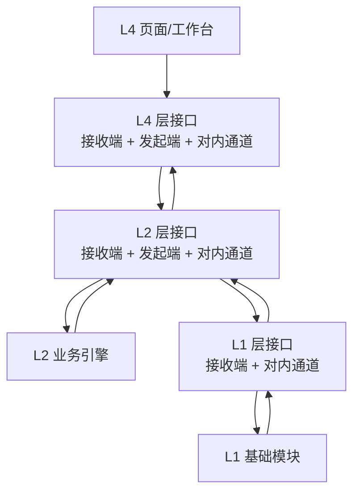

# 层接口对内通道设计与模块接入规范

**版本：** v0.2  
**日期：** 2026-07-16  
**维护方：** 平台架构组  
**最高依据：** 《AI平台架构框架说明 v2.2》《v2.2 架构冲突解决与落地决议 v0.1》  
**适用对象：** 业务应用层组、业务引擎层各引擎组、基础模块层各模块组、平台配置管理组、测试组、部署运维组。  
**目的：** 将“层接口的对内通道”落成各组可实现、可测试、可部署的统一规则。

## 1. 先统一一个定义

对内通道不是业务引擎，不是任意服务互调的 RPC 总线，也不是共享数据库。

它是**每一层唯一层接口中的受控内部投递能力**：本层的模块或引擎只能向它提交登记过的标准指令；它负责查表、验来源、判权限、执行安全义务、留痕、投递与回传。模块不持有其他模块的直连地址、数据库账号或私有调用协议。

```text
本层模块 / 引擎
  -> 对内通道：校验、能力查表、权限、安全、审计、幂等
  -> 本层目标模块 / 引擎
  -> 标准回复或回调
  -> 对内通道
  -> 原发起模块 / 引擎
```

**对内通道只负责“安全送件”；谁决定下一步由谁办，仍由架构定义的责任模块决定。**

- L4：只做界面内部协作与结果分发，不做业务引擎选派。
- L2：意图分析交已确认命令；流程执行是唯一子任务派发者；执行引擎回报流程执行。
- L1：模块之间只能经 L1 对内通道取用登记能力；唯一机制性直达是对内通道向 L1.1 权限管理请求判权，防止循环。

## 2. 三层的层接口如何组成

每层层接口最多有三个端，由同一个接口控制模块统一管理。

| 端 | 作用 | 三层落地 |
| --- | --- | --- |
| 请求接收端 | 接收相邻上层或登记系统来源的请求 | L4 接收用户/已登记通知；L2 接收 L4；L1 只接收 L2。 |
| 请求发起端 | 向相邻下层发请求，或把结果/通知送回上层 | L4 只向下发；L2 向 L1 发起并向 L4 回送；L1 没有向下发起端。 |
| 对内通道 | 本层模块/引擎之间的受控投递 | L4 协调工作台、卡片和结果呈现；L2 组织引擎；L1 组织基础能力协作。 |



## 3. 对内通道的统一处理顺序

每次内部投递严格执行以下顺序，任一步失败即返回标准 `failed`，不透传原始请求。

```text
1. 协议校验：公共信封、Schema 版本、trace_id、父消息、幂等键。
2. 来源校验：source_service 是否被允许发起该 route_type/action。
3. 能力校验：capability_id 是否存在，目标服务是否为当前有效承办者。
4. 状态校验：task_id / workflow_instance / pending_intent 是否存在且允许迁移。
5. 权限判定：向 L1.1 请求本次真人、动作、资源、范围、状态的实时决定。
6. 安全义务：执行 L1.9 返回的脱敏、外发限制、审计等义务。
7. 容量与运行控制：需要模型、沙箱或高成本能力时请求成本/驾驭控制。
8. 审计开始：记录 message_id、trace_id、来源、目标、动作、decision_id。
9. 投递目标服务：仅投递已登记的 action。
10. 校验回复：只允许 success / accepted / failed，校验引用关系。
11. 审计结束：记录结果类型、耗时、错误码、产物/数据引用摘要。
12. 返回或等待回调：accepted 必须有 task_id、状态查询动作和状态责任方。
```

## 4. 公共内部指令

所有对内投递在公共通信信封基础上使用以下字段。业务字段只能放在 `payload`，不得把数据库地址、模型密钥、旧系统凭据或未经授权的敏感正文塞入消息。

```json
{
  "protocol_version": "1.0",
  "message_id": "msg_xxx",
  "trace_id": "trace_xxx",
  "request_id": "req_xxx",
  "parent_message_id": "msg_parent",
  "source": {"layer": "L2", "service_code": "l2.workflow_execution"},
  "target": {"layer": "L2", "service_code": "l2.content_generation"},
  "channel": "l2_internal",
  "route_type": "task.dispatch",
  "action": "content.generate",
  "capability_id": "CAP.CONTENT.DRAFT.GENERATE",
  "actor": {"person_id": "person_001", "position_ids": ["position_marketing"]},
  "context": {
    "workflow_instance_id": "flow_001",
    "node_id": "node_generate_copy",
    "task_id": "task_001",
    "data_refs": [],
    "artifact_refs": []
  },
  "idempotency_key": "flow_001-node_generate_copy-v1",
  "deadline_at": "2026-07-16T20:00:00+08:00",
  "payload": {}
}
```

### 4.1 L2 固定的三类路由

| `route_type` | 唯一允许来源 | 唯一允许目标 | 必传内容 | 目标可改变的状态 |
| --- | --- | --- | --- | --- |
| `command.handoff` | 意图分析 | 流程执行 | `command_id`、确认状态、`capability_ids`、参数和引用 | 流程执行可创建流程实例。 |
| `task.dispatch` | 流程执行 | 一个执行引擎 | `workflow_instance_id`、`node_id`、`task_id`、`capability_id`、动作、输入引用、截止时间 | 执行引擎仅可更新自己的执行记录/产物。 |
| `flow.callback` | 执行引擎、登记的 L1 异步服务、旧系统回执适配 | 流程执行 | 原 `task_id`、状态、结果引用/错误、回调幂等键 | 仅流程执行可推进流程、节点和子任务。 |

**禁止的 L2 路由：** `意图分析 -> 执行引擎`、`执行引擎 -> 执行引擎`、`执行引擎 -> L4`、`执行引擎 -> 流程状态库`。对内通道必须以 `caller_not_allowed` 拒绝并审计。

### 4.2 L1 的机制性直达例外

L1 对内通道每次投递前都必须请求 L1.1 `permission.decide`。这一调用不再通过 L1 对内通道，原因是判权本身若也先判权会形成循环。它必须满足：

- 只允许接口控制模块调用；普通 L1/L2 业务模块不得伪装为该调用方。
- 只用于生成 `decision_id`、`allow/deny`、制度依据和义务。
- 携带同一 `trace_id` 并记录审计事件。
- 不得用于获取业务数据、修改业务状态或绕过安全合规。

## 5. 能力字典与能力登记表

v2.2 规定：意图分析不凭自然语言名称选引擎；流程执行不凭模型猜测选引擎。

```text
用户自然语言
-> 意图分析：识别 capability_id 和参数
-> 已确认 command
-> 流程执行：按 capability_id 查能力登记表
-> 得到当前承办 service_code、Schema、版本、限制
-> task.dispatch
```

### 5.1 两张表不可混用

| 表 | 管什么 | 所有者 | 运行期用途 |
| --- | --- | --- | --- |
| 能力字典 | 平台具备哪些能力及统一编号 | 架构组维护，按版本发布 | 意图分析把用户请求映射为 `capability_id`。 |
| 能力登记表 | 某能力当前由哪个服务承办 | 平台配置管理账号维护，架构组设门禁 | 流程执行按编号确定性选派。 |

能力登记表最小字段：

```text
capability_id, service_code, action, layer, schema_version,
allowed_callers, required_permission_action, data_labels,
sync_timeout_seconds, callback_supported, health_status,
contract_test_status, effective_from, rollback_version, owner
```

### 5.2 改派与启停的硬门槛

平台配置管理账号可以启用、停用、扩缩、改派服务，但不能跳过以下门槛：

1. 新服务已提交服务登记包和签名 manifest。
2. `capability_id`、输入/输出 Schema、权限动作、数据标签、超时、回调语义兼容。
3. 健康检查、契约测试、权限拒绝、幂等和回调测试均通过。
4. 配置变更经确认卡片确认，保留旧版本和一键回退版本。
5. 正在运行的流程实例冻结原 `service_code + schema_version`，不得因改派被无声切换。

“自动发现新部署服务”只能展示 manifest，不等于自动启用或自动理解其业务语义。

### 5.3 确认、版本与数据生命周期的通道门禁

- `command.handoff` 必须包含 `requires_user_confirmation`。值为 `true` 时，对内通道必须验证对应 `pending_intent` 已由原发起真人确认；否则拒绝 `flow.start`。
- 高风险、存改数据、外部写入、审批、资产创建/开放、对外发布的命令不得标记为免确认；低风险只读、纯查询和确定性表单的免确认依据必须在能力/规则登记中可查。
- 流程第一次选派时冻结 `capability_dictionary_version`、`registry_version`、`service_code` 和 `schema_version`；配置改派只影响新实例。
- 任意含 `data_ref/artifact_ref` 的写入或中间结果必须声明 `storage_class`、`owner_service`、`retention_policy`、`trace_id/task_id`。流程未终态前，对内通道不得允许清理其必需引用。

## 6. L4 业务应用层：各组该做什么

| L4 组件组 | 通过 L4 对内通道提交什么 | 接收什么 | 明确不得做什么 |
| --- | --- | --- | --- |
| 对话工作台 | `chat.send`、`intent.confirm`、补充信息 | 补问、确认卡片、任务状态、最终结果 | 指定 L2 承办引擎、直接调模型/L1。 |
| 业务表单/项目页 | `business.submit`、确定性查询 | `success/accepted/failed`、表单状态 | 绕过流程执行直接派发执行引擎。 |
| 待办中心 | `human.decide`、`task.get`、`notification.list` | 人工待办、通知、结果引用 | 自行改变流程/审批状态。 |
| 右栏信息分发 | 只消费已授权的 `data/artifact_ref` | 资产卡、统计卡、可下载产物 | 擅自读取数据模块或共享给其他真人。 |

L4 对内通道必须按 `actor.person_id + tenant_id + project_id + scope` 把结果送达对应工作台；它只做确定性分发，不使用模型做路由判断。

## 7. L2 业务引擎层：各组该做什么

### 7.1 命令中枢

| 引擎 | 对内通道中的职责 | 输入 | 输出 | 禁止事项 |
| --- | --- | --- | --- | --- |
| 意图分析 | 产生 `command.handoff`，不产生派发单 | 自然语言、上下文引用、能力字典 | 补问/待确认意图，或已确认 `command_id + capability_ids + 参数` | 不选承办引擎，不派发执行引擎。 |
| 流程执行 | 唯一 `task.dispatch` 发起者和 `flow.callback` 接收者 | 已确认命令、表单、人工决定、回调 | 实例、节点、子任务、待办、汇总结果 | 不直接办解析、计算、内容、外部读写等业务动作。 |

### 7.2 十一个执行引擎

| 执行引擎 | 仅接收的典型能力 | 回调给流程执行的最小结果 | 主要 L1 能力 |
| --- | --- | --- | --- |
| 文档表格解析 | `CAP.DOCUMENT.PARSE` | `data_ref`、字段来源、质量异常 | 数据、模型、安全合规。 |
| 外部系统对接 | `CAP.EXTERNAL.READ/WRITE` | `operation_id`、外部回执、结果引用 | 设备与系统接口、数据、安全合规。 |
| 数据操作 | `CAP.DATA.READ/CREATE/UPDATE/DELETE` | 数据资产编号、`data_ref`、资产账变更 | 数据、账号网关、安全合规。 |
| 规则计算 | `CAP.RULE.EVALUATE` | 计算结果、`rule_ref`、数字来源 | 数据、沙箱、模型、上下文。 |
| 分析预测 | `CAP.ANALYSIS.FORECAST` | 分析结论、指标版本、置信范围、图表数据 | 数据、沙箱、模型、上下文。 |
| 知识库问答 | `CAP.KNOWLEDGE.ANSWER` | 回答、引用、无法回答原因 | 知识库、模型、上下文。 |
| 内容产出 | `CAP.CONTENT.DRAFT.GENERATE` | 文本草稿 `artifact_ref`、审核标记 | 模型、上下文、数据、安全合规。 |
| 多媒体生成 | `CAP.MEDIA.GENERATE` | 图片/音频/视频 `artifact_ref`、标识检查 | 模型、知识库、数据、安全合规。 |
| 监控提醒 | `CAP.NOTIFICATION.DISPATCH` | `notification_receipt`、送达/升级状态 | 数据、账号网关、安全合规。 |
| 数字资产 | `CAP.ASSET.CREATE/UPDATE/DELETE/USE` | 智能体/技能/知识库资产登记或草案引用 | 知识库、数据、驾驭、安全合规。 |
| 项目管理 | `CAP.PROJECT.CREATE/UPDATE/ARCHIVE` | 项目编号、台账状态、归档目录 | 权限、数据、人机协同。 |

执行引擎的统一实现边界：

```text
收到 task.dispatch
-> 校验 task_id、能力编号、输入引用、截止时间
-> 仅调用登记的 L1 服务
-> 产出 data_ref / artifact_ref / task_receipt / failed
-> 回 flow.callback
-> 不调用另一个 L2 执行引擎，不直接通知 L4
```

## 8. L1 基础模块层：各组该做什么

L1 内部也必须通过 L1 对内通道调用服务；任何模块不得读取另一个模块的数据库或对象存储。下表定义每个模块必须暴露的最小服务方向。

| L1 模块 | 需登记的最小服务 | 对内通道的关键校验 | 不得承担 |
| --- | --- | --- | --- |
| L1.1 权限管理 | `permission.decide`、`permission.grant_scope` | 真人、岗位、动作、资源、范围、状态、制度依据 | 登录认证、流程推进。 |
| L1.2 流程模板管理 | `template.retrieve`、`template.publish` | 模板版本、适用公司、维护权限 | 流程实例和节点推进。 |
| L1.3 进化机制 | `evolution.propose`、`evolution.confirm` | 本人范围/共享范围、确认状态、可回退性 | 自行发布资产。 |
| L1.4 驾驭机制 | `governance.check_run` | 风险等级、步数/工具/范围、真人确认要求 | 动作权限判定、沙箱执行。 |
| L1.5 大模型调度 | `model.generate` | 模型能力、预算、数据出域限制、提示词引用 | 业务编排、直接服务 L4。 |
| L1.6 上下文与提示词 | `context.resolve`、`context.save_pending`、`prompt.render` | 本人/Project 范围、过期时间、上下文版本 | 长期跨人记忆、底层物理存储。 |
| L1.7 数据 | `data.read`、`data.write`、`artifact.store` | `data_ref`、数据标签、临时/固定存、保留期 | 业务语义判断、引擎选派。 |
| L1.8 账号网关 | `identity.resolve_session`、`identity.resolve_actor` | 会话、租户、岗位事实 | 最终权限判断。 |
| L1.9 安全合规 | `compliance.inspect_input/output`、`audit.query` | 敏感字段、外发场景、审计义务 | 授权决策、流程推进。 |
| L1.10 设备与系统接口 | `system.read/write`、`system.operation_status` | 连接器、字段映射、`operation_id`、真人放行 | 判断业务是否该读写。 |
| L1.11 人机协同 | `human_task.create/decide` | 待办归属、岗位、审批依据、决定幂等 | 决定流程下一节点。 |
| L1.12 成本管控 | `cost.reserve/settle` | 人/部门/Project 预算、模型用量 | 模型路由、业务成本核算。 |
| L1.13 知识库 | `knowledge.retrieve`、`knowledge.ingest` | 知识范围、引用、访问权限 | 组织最终回答。 |
| L1.14 执行沙箱 | `sandbox.execute/status` | 代码/工具、资源、网络白名单、快照策略 | 业务授权、生产直写。 |
| L1.15 记忆管理 | `memory.retrieve/append` | 客户/项目/事件中心、读写权限、真人确认 | 个人即时上下文、知识库问答。 |

### 8.1 数据写入的两类边界

为避免“数据操作引擎”和“其他模块写数据”冲突，统一如下：

| 数据动作 | 责任方 | 例子 |
| --- | --- | --- |
| 业务数据的登记、标签、长期存档、增删改 | 数据操作引擎组织，L1.7 执行物理存取 | 把确认后的方案存入 Project、更新客户业务数据。 |
| 模块运行状态、临时中间结果、本模块产物记录 | 状态责任模块通过 L1.7 服务写入 | 流程节点状态、待确认意图、模型调用摘要、解析临时结果。 |

所有写入必须声明 `storage_class=temporary/fixed`、`owner_service`、`retention_policy`、`data_labels`。临时数据不得在关联流程未终态前被清理；固定存必须是独立的“存”动作并按权限要求触发确认。

## 9. 权限、安全、状态和回调

### 9.1 每次动作重判权

以下不是一次登录后可复用的权限，而是独立动作：

```text
intent.analyze -> intent.confirm -> flow.start -> task.dispatch
-> data.read -> model.generate -> artifact.store -> system.write
-> asset.use -> asset.share_scope_change -> artifact.read
```

每次判权至少包含：`person_id`、岗位、租户、动作、资源类型/编号、数据标签、当前状态、Project 范围、用途和时间；返回 `decision_id`、`allow/deny`、依据和义务。

### 9.2 回调最小要求

```json
{
  "route_type": "flow.callback",
  "action": "flow.callback",
  "trace_id": "trace_xxx",
  "parent_message_id": "msg_dispatch_xxx",
  "context": {
    "workflow_instance_id": "flow_001",
    "node_id": "node_001",
    "task_id": "task_001"
  },
  "payload": {
    "status": "completed",
    "result": {"result_type": "artifact_ref", "artifact_ref": "artifact_001"},
    "error": null
  },
  "idempotency_key": "callback-task_001-v1"
}
```

流程执行只有在以下全部成立时才推进状态：来源服务登记正确、父消息匹配、任务属于该流程、当前状态允许迁移、回调 Schema 合法、幂等键未处理。

## 10. 网络与部署必须强制的边界

规则不能只写在文档里，部署必须让越界调用技术上失败。

```text
L4 服务：只允许访问 L4 层接口。
L2 意图/流程/执行引擎：只允许访问 L2 对内通道和登记的 L1 层接口。
L1 模块：只允许访问 L1 对内通道；权限管理的判权端点仅允许接口控制模块访问。
执行引擎之间：不配置网络路由、不分发对方地址和密钥。
数据库/对象存储：只给数据责任模块账号；其他模块只能调服务。
旧系统凭据：只在 L1.10 部署配置内；不进入浏览器、请求 payload、日志或提示词。
```

## 11. 各组必须提交的接入包

```text
module-name/
  service-manifest.json
  capability-claims.json
  schemas/
    action.input.schema.json
    action.output.schema.json
    callback.schema.json
  examples/
    success.json
    accepted.json
    failed.json
  tests/
    contract_test
    permission_test
    idempotency_test
    callback_test
  README.md
```

README 必须回答：

1. 本模块只承办哪些 `capability_id` 和 `action`？
2. 允许哪些来源服务调用？
3. 输入/输出传递哪些 `data_ref`、`artifact_ref`、状态或结果？
4. 哪个服务拥有状态，谁能推进它？
5. 权限动作、数据标签、超时、重试、幂等和回调规则是什么？
6. 本模块明确不做什么，避免与谁重叠？

## 12. 架构组、配置组和测试组的职责

| 小组 | 必须交付 |
| --- | --- |
| 架构组 | 公共协议、对内通道 SDK、能力字典、服务登记 Schema、错误码、Mock、契约测试工具、边界裁决。 |
| 平台配置管理组 | 能力登记表维护界面、确认卡片、启停/改派/回退、变更审计；不能绕过测试门禁。 |
| 测试组 | 方向拒绝、Schema、权限放行/拒绝、临时存清理、回调幂等、超时、改派兼容、回退测试。 |
| 运维组 | 网络隔离、服务身份、密钥托管、健康检查、日志/审计保留、灾备与版本发布。 |

## 13. 上线验收清单

一个模块只有全部满足才可从 `draft/mock` 变为 `active`：

- 已认领能力字典编号，能力登记表有对应服务记录。
- 仅接受允许来源和已登记 action；错误来源能被拒绝。
- 公共信封和三种回复均通过 Schema 校验。
- 每个动作有实时 `decision_id` 和安全义务执行记录。
- `accepted` 有可查询的任务记录和状态责任方。
- 重复请求、重复回调不重复执行业务动作或推进状态。
- 数据只通过 `data_ref/artifact_ref` 跨模块流转，无共享数据库直连。
- 健康检查、超时、下游不可用、权限拒绝、回退均有测试证据。
- 网络策略已阻断未登记的服务直连。

## 14. 一句话给每个组

```text
L4：只把用户的话、表单和决定送进接口，并展示回来的一切。
意图分析：只确认用户到底要什么，并交能力编号，不派活。
流程执行：只负责查表、排步骤、派活、等回调、推进状态。
执行引擎：只办派给自己的一件事，带结果回流程执行。
L1：只提供登记的基础能力，不直接面对页面，也不共享存储。
对内通道：只按规则送件、判权、留痕，不替任何业务模块作决定。
```
