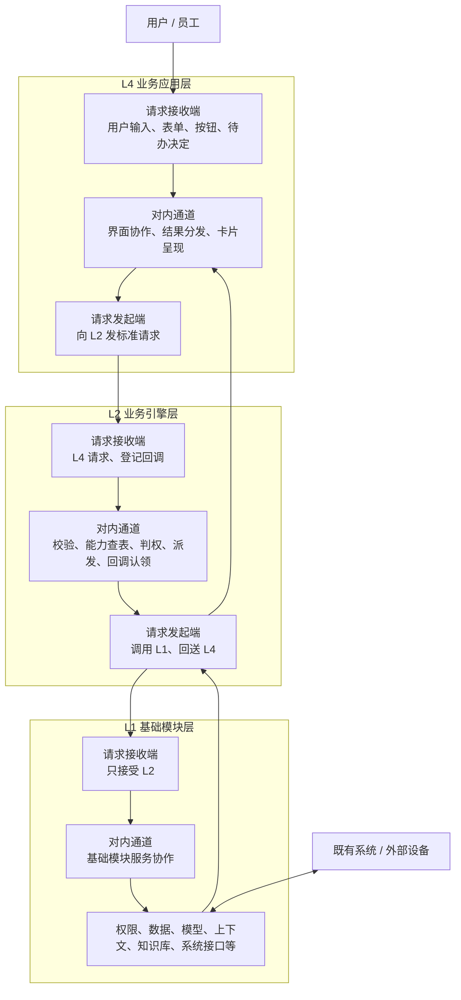
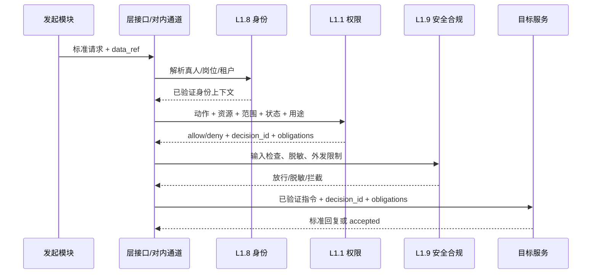
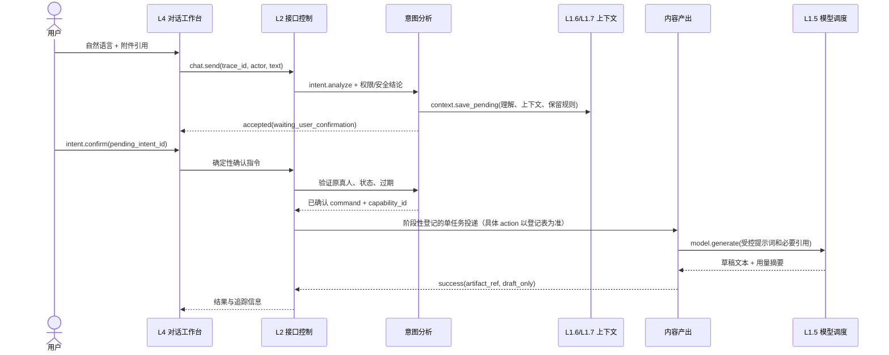
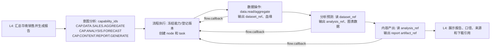
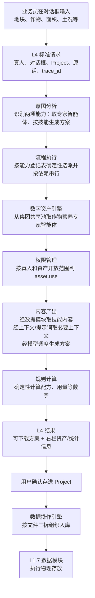

# 数据流转、对接与通信交互规范

**版本：** v0.3  
**日期：** 2026-07-17  
**维护方：** 平台架构组  
**最高依据：** 《AI平台架构框架说明 v2.2》全文、《层间交互逻辑图 v2.6》。  
**配套文件：** 《平台层间通信与权限协议 v0.6》《层接口对内通道设计与模块接入规范 v0.2》《v2.2 架构冲突解决与落地决议 v0.1》。  
**适用对象：** L4、L2、L1 全部开发组，平台配置管理组，测试组，部署运维组。  
**目的：** 规定数据如何进入平台、如何跨层与层内传递、如何对接旧系统、如何返回、如何存储、如何判权和审计。

## 0. 本文的事实边界

为防止把推测写成架构结论，本文的规则按来源分为三类：

| 标记 | 含义 | 可否当作当前架构事实 |
| --- | --- | --- |
| **[v2.2]** | 《AI平台架构框架说明 v2.2》已明确的框架规则 | 可以。 |
| **[协议]** | 已发布通信/权限/对内通道协议定义的技术契约 | 可以，适用于联调。 |
| **[待专项定义]** | v2.2 明确留待数据、权限、运维等专项文件定义的细节 | 不得自行假定为业务制度或生产参数。 |

本文不会把存储产品、TTL 数值、具体数据库、具体网络实现、十大经营系统的业务模型写成既定事实；这些内容只能由对应专项方案和配置登记补充。

## 1. 一条总原则

```text
跨模块传引用，不默认传原文。
跨层走层接口，不直接跨层。
层内走对内通道，不直接互调。
每次读、写、传、展示、外发都按当前真人和当前动作重新判权。
数据的业务语义、物理存储、流程状态、权限结论和平台配置各有唯一责任方。
```

平台不是把所有数据集中复制到一个 AI 数据库，而是让用户在受控条件下使用既有系统、平台数据和 AI 能力完成工作。旧系统仍是订单、财务、人员、教务等正式业务数据的权威来源；平台保存引用、办理记录、授权证据、必要的固定存档和 AI 产物。

## 2. 数据分类与责任边界

| 数据类别 | 例子 | 逻辑责任 | 物理责任 | 跨模块传递方式 |
| --- | --- | --- | --- | --- |
| 业务数据 | 订单、报销单、客户、成绩、项目台账、销售明细 | 数据操作引擎组织业务操作 | 旧系统或 L1.7 数据模块 | `data_ref`。 |
| 文件/附件 | Word、Excel、PDF、发票、图片、音视频 | 上传任务或承办引擎 | L1.7 数据模块的物理存储 | `artifact_ref`。 |
| 流程数据 | 流程实例、节点、子任务、回调、超时 | 流程执行引擎 | 流程状态库/L1.7 | `workflow_instance_id`、`node_id`、`task_id`。 |
| 会话上下文 | 对话摘要、待确认意图、提示词版本 | L1.6 上下文与提示词 | L1.7 数据模块 | `context_ref`；仅通过 `context.*` 服务。 |
| 长期记忆 | 客户、项目、事件的跨人记忆 | L1.15 记忆管理 | 按数据与知识库专项机制落位 | `memory_ref`。 |
| 知识资料 | 制度、手册、工艺、文献、检索片段 | L1.13 知识库 | 知识库模块及其专项存储机制 | `knowledge_ref`、引用列表。 |
| 数字资产 | 智能体、技能、知识库登记、版本 | 数字资产引擎 | 登记信息/内容分别入 L1.7、L1.13 | `asset_ref`。 |
| AI 产物 | 文案、报告、图片、视频、模型摘要 | 对应产出引擎 | L1.7 产物库 | `artifact_ref`。 |
| 身份与权限 | 会话、岗位、授权、`decision_id` | L1.8、L1.1 | 各自专属存储 | 受验证的身份上下文、`decision_id`。 |
| 平台配置 | 能力字典、能力登记表、路由规则 | 架构组/平台配置管理账号 | 配置仓库，不进入数据模块 | `capability_id`、版本、服务登记。 |
| 审计与安全 | 追踪链、脱敏事件、越权告警 | L1.9/架构审计 | 不可篡改审计库 | `trace_id`、`audit_ref`。 |

### 2.1 业务数据与平台数据不能混

```text
销售订单、报销金额、学生成绩：业务数据。
workflow_instance、task_id、模型耗时：平台运行数据。
技能开放给谁：数字资产授权数据。
能力登记表：平台接线配置。
```

业务数据的长期新增、修改、删除、归档，必须由**数据操作引擎组织**，L1.7 仅执行物理存取。流程状态、临时解析结果、模型调用摘要等由各自状态责任方写入，但也必须经登记服务完成，不得直连数据库。

### 2.2 标签、权限、敏感字段不是一回事

| 概念 | v2.2 定位 | 在数据流中怎么用 |
| --- | --- | --- |
| 资产/数据标签 | 用于说明、分类、检索和登记 | 可随 `data_ref/asset_ref` 传递，帮助承办服务识别对象。 |
| 权限 | 不附着在智能体、技能、知识库或业务数据本身 | 每次按当前真人、岗位、资源和动作由权限管理实时判定。 |
| 字段敏感性 | 安全合规进行脱敏的依据 | 使用、展示、外发前按字段内容遮挡；不引入密级体系。 |
| 追踪编号 | 串起一次办理的证据链 | 关联请求、回执、通知、确认、结果和审计。 |

因此，`data_labels` 或 `asset_ref` 不能被实现为“自带授权令牌”；标签说明对象，权限管理决定当前真人能否取、存、改、展示或开放。

## 3. 层接口、对外通道与对内通道



### 3.1 三层各自必须做什么

| 层 | 收到的数据 | 必做处理 | 可向下传什么 | 不得做什么 |
| --- | --- | --- | --- | --- |
| L4 | 文本、表单、附件、按钮决定 | 认证会话、生成追踪编号、界面状态与结果分发 | 标准信封、用户输入、引用、确认/审批决定 | 选引擎、带模型/旧系统密钥、直接访问 L1。 |
| L2 | L4 请求、人工决定、执行回调 | 协议/目录/权限/安全、意图理解、流程编排、能力选派 | 已授权的 L1 能力请求、`data_ref/artifact_ref` | 共享模块数据库、绕过流程状态。 |
| L1 | 已登记的 L2 能力请求 | 提供精确基础能力、返回结果/回执/失败 | 对外系统连接仅经 L1.10 | 面向 L4 提供普通业务服务、主动编排业务流程。 |

### 3.2 L4 的信息分发与确认卡片

业务应用层接口对结果、回执、预警、待办和进度通知执行**确定性分发**：依据消息携带的真人身份标识和范围标识，将“谁发起的结果”送回谁的界面，将“谁应处理的待办”送到对应工作台；这不是模型判断。

对会改动数据或系统状态的操作，v2.2 的界面固定机制是：

```text
在对话框沟通或上传信息
-> 平台提炼为确认卡片
-> 当前操作人点击确认
-> 才向下发出执行指令并留痕
```

纯查看、核对类操作不需要确认卡片。数据安全官、组织信息管理员、项目管理中心、应急监察账号、平台配置管理账号同样使用标准工作台和这一确认方式，而不是绕过层接口直接修改数据或配置。

## 4. 统一通信对象

### 4.1 请求信封必须携带什么

```json
{
  "protocol_version": "1.0",
  "message_id": "msg_xxx",
  "trace_id": "trace_xxx",
  "request_id": "req_xxx",
  "parent_message_id": "msg_parent",
  "source": {"layer": "L2", "service_code": "l2.workflow_execution"},
  "target": {"layer": "L2", "service_code": "l2.data_operation"},
  "channel": "l2_internal",
  "route_type": "task.dispatch",
  "action": "data.aggregate",
  "capability_id": "CAP.DATA.SALES.AGGREGATE",
  "capability_dictionary_version": "2026.07.16",
  "registry_version": "registry_2026.07.16",
  "actor": {"person_id": "person_001", "tenant_id": "tenant_hanhe"},
  "context": {
    "workflow_instance_id": "flow_001",
    "node_id": "node_001",
    "task_id": "task_001",
    "data_refs": []
  },
  "idempotency_key": "flow_001-node_001-v1",
  "deadline_at": "2026-07-17T10:00:00+08:00",
  "payload": {}
}
```

| 字段 | 数据流转作用 |
| --- | --- |
| `trace_id` | 串起一次任务的每一跳、权限、回调、通知和审计。 |
| `message_id` / `parent_message_id` | 还原消息父子关系，防止回调认错派发单。 |
| `actor` | 表示当前责任真人；智能体不能替代真人承担权限责任。 |
| `capability_id` / 版本 | 意图分析提出需求、流程执行查能力登记表选承办者。 |
| `data_refs/artifact_refs` | 传数据/产物引用、版本、标签和允许动作，不默认复制正文。 |
| `workflow_instance_id/node_id/task_id` | 使回调能精确恢复对应节点。 |
| `idempotency_key` | 防重复写入、重复派发、重复回调。 |

### 4.2 标准结果如何返回

| `reply_type` | 数据含义 | L4 行为 |
| --- | --- | --- |
| `success` | 当前动作已完成，带 `data` 或 `artifact_ref` | 展示结果/刷新页面。 |
| `accepted` | 已登记长任务，带 `task_id`、状态和查询动作 | 显示处理中，等待通知或轮询。 |
| `failed` | 未受理或处理失败，带稳定错误码和是否可重试 | 展示原因，不自行猜测重试。 |

## 5. 权限与安全在数据流转中的位置

权限不是“进入系统时判一次”，而是每次具体数据动作都重新判定。



最少必须分别判定的动作：

```text
asset.use                调用智能体/技能/知识库
data.read                读取业务数据、文件、统计
data.persist/update/delete 长期存档、修改、删除
system.read/system.write  读取或写入旧系统
model.generate           将数据送入模型
artifact.read            展示或下载产物
asset.share_scope_change 开放资产给更多人
human.approve            审批或关键确认
```

前一步的 `decision_id` 不能复用到下一动作。安全合规负责字段脱敏、输入输出红线、越权告警和审计；它不替代权限管理作“是否允许”的业务授权判断。

账号网关提供“当前真人是谁、挂什么岗位、属于哪个租户”的事实；公司统一采购、供员工共用的外部工具会员凭证由账号网关托管。连接 ERP、OA、设备等系统的机器接入凭证则只由 L1.10 设备与系统接口保管，两者不得混入请求正文或日志。

## 6. 数据引用与存储生命周期

### 6.1 默认传引用

```json
{
  "ref_id": "dataref_sales_202606",
  "resource_type": "sales_dataset",
  "source_system": "erp_e10",
  "version": "snapshot_20260717_001",
  "data_labels": ["internal"],
  "allowed_actions": ["read", "aggregate"],
  "lineage": ["system.read:erp_e10", "data.aggregate:task_001"],
  "expires_at": "2026-07-18T10:00:00+08:00"
}
```

原文只在以下条件同时满足时短时传递：目标服务确实需要正文、`data.read/model.generate/system.write` 已放行、安全合规已处理、传递范围明确。日志中只记录引用、摘要、长度、标签和校验值。具体脱敏方式、保留期限和物理传输加密方式属于 **[待专项定义]**，由数据/安全专项规则确定。

文件、文档和产物需要固定存时，v2.2 案例采用“文件三拆”原则：原件进入文件库，登记信息进入结构化目录，正文文字含义转换后进入向量库；具体存储产品、字段、保留周期和清理机制仍由数据机制专项定义。文档表格解析引擎负责读取、抽取和来源定位，不承担业务计算；数字资产引擎负责知识库的建库、装载、登记，知识库模块只做检索，知识库问答引擎才组织最终回答。

### 6.2 临时存与固定存

| 场景 | 存储类别 | 谁发起 | v2.2 已明确的规则 |
| --- | --- | --- | --- |
| 外部系统取回供本次分析 | 临时存 | 外部系统对接/数据操作 | [v2.2] 用完即删，仅为当前办理；具体规则另行确定。 |
| 待确认意图、会话上下文 | 由上下文策略决定 | L1.6 经 `context.*` | [v2.2] 上下文逻辑归 L1.6、实际存放归数据模块；具体保留规则另行确定。 |
| 解析中间结果、模型中间输出 | 临时存或固定存 | 承办引擎 | [待专项定义] 由数据机制说明按用途确定。 |
| 用户确认“存进 Project” | 固定存 | 数据操作引擎 | [v2.2] 是独立的“存”动作，写入数据模块且需要确认、留痕。 |
| 正式业务写入 | 外部系统权威记录 | 外部系统对接引擎 | [v2.2] 写回前必须真人确认；具体对账/重试机制由系统接口专项定义。 |

每项写入在 **[协议]** 接入包中必须声明：

```text
storage_class, owner_service, trace_id, task_id,
retention_policy, delete_after, recovery_policy, data_labels
```

## 7. 完整数据流一：第一阶段内容草稿

v2.6 的第一阶段是框架验证，流程执行引擎尚未上线。图中明确第一阶段建设意图分析、内容产出、权限管理、大模型调度、对话界面，并标注“单任务，暂不经流程执行引擎”。

**边界说明：** v2.6 尚未定义“意图分析之后如何把单任务交给内容产出”的完整路由契约。第一阶段实施前，架构组必须在能力登记表中单独登记这一阶段性路由，包括允许来源、目标服务、能力编号、确认规则、输入输出和退出条件；未登记的多引擎编排、旧系统写入、资产创建、审批和业务数据存改不得借此阶段性安排执行。



第一阶段生成草稿不等于永久保存。用户点击“存进 Project”属于独立的固定存动作；在数据操作能力和对应专项规则上线前，只能作为演示能力，不能模拟真实业务数据写入。

## 8. 完整数据流二：第二阶段数据分析与报告

第二阶段流程执行、数据操作、规则计算和分析预测上线后，所有多步骤任务必须走完整流程。



每个箭头都经过 [v2.2] 的接口控制模块校验、按当前真人判权、留痕计量和登记分派；细化为动作级权限、安全义务、引用 Schema 的要求来自 [协议]。流程执行按数据依赖组织：数据操作不把整库数据复制给分析预测；分析预测不把全部中间数据塞进内容产出；内容产出只取得写报告所需的、已授权的分析引用。

## 9. 完整数据流三：第三阶段旧系统读写

```text
用户提交确定性业务表单
-> L4 -> L2 接口：身份、协议、action 权限
-> 流程执行：创建流程和真人确认节点
-> 外部系统对接：按字段映射组织限定读/写动作
-> L1.10 系统接口：使用机器接入凭证连接 ERP/OA
-> 旧系统：返回 data_ref 或 operation_id/回执
-> 外部系统对接：flow.callback
-> 流程执行：推进、补偿、通知或结束
-> L4：展示结果
```

外部写入必须额外满足：

```text
system.write 权限通过
人机协同/流程执行的真人放行已完成
安全合规检查通过
operation_id 已创建并全重试复用
旧系统回执或状态查询可对账
```

无法确认旧系统是否已写入时，不得盲目再次写入。具体状态名称、回执查询、重试和补偿机制属于 [协议]/系统接口专项的实现规则，必须在外部系统接入登记中明确。

## 10. 案例校验与层内数据交互规则

### 10.1 v2.2 案例一的事实数据流：调专家分身并推广技能

以下链路直接依据 v2.2 第六章“专家能力平民化”案例，不替换为抽象假设：



该案例明确的事实如下：

1. L4 初始请求只带原话、真人、对话框、Project 和追踪编号；**不搬运整包对话记忆**。需要上下文的引擎自行经上下文与提示词管理、记忆管理取用。
2. 智能体/技能/知识库资产本身不携带权限。数字资产引擎负责取用和登记，权限管理按当前真人与资产开放范围判定 `asset.use`。
3. 内容产出引擎取得技能内容、必要上下文和模型能力；涉及数字的配方与用量不由模型计算，交规则计算引擎做确定性计算。
4. 方案生成后可以交付下载；若要长期留在平台，必须另发“存”动作，由数据操作引擎组织、写入数据模块，并由用户确认后留痕。
5. 右栏的资产来源和调用次数来自资产登记与数据操作的只读统计；采纳率不是直接读取的字段，而是规则计算引擎用两个总数当场计算。
6. 大区经理查看统计时仍要按当前真人判定取数权限；将技能开放给全大区是授权动作，权限管理先判本人是否有权，再修改开放范围；数字资产引擎只同步资产登记。

### 10.2 案例一中“结果、统计、存档、开放”是四个不同动作

| 用户看到的行为 | 实际数据动作 | 主责模块 | 是否需要独立判权/确认 |
| --- | --- | --- | --- |
| 下载方案 | 展示/读取已生成产物 | L4 + 内容产出结果 | 需要展示/下载权限；是否需要确认按产物规则。 |
| 存进 Project | 固定存档、文件三拆、写数据模块 | 数据操作 -> L1.7 | 是，v2.2 明确需用户确认。 |
| 查看采纳率 | 读取两个总数并由规则计算当场计算比率 | 数据操作 + 规则计算 | 是，取数按当前真人判权；纯查看不需确认卡片。 |
| 推广到全大区共享池 | 改变技能开放范围 | 权限管理，数字资产同步登记 | 是，授权动作，确认卡片后生效。 |

### 10.3 L2 对内通道

| 路由 | 允许的数据 | 不允许的数据 |
| --- | --- | --- |
| `command.handoff` | 已确认命令、能力编号、参数、上下文引用 | 执行引擎地址、数据库凭据、未确认的业务写入指令。 |
| `task.dispatch` | `task_id`、能力编号、输入引用、截止时间、幂等键 | 整库复制、其他执行引擎的私有任务、绕过流程的下一步指令。 |
| `flow.callback` | 状态、结果引用、错误码、回调幂等键 | 对流程状态的直接写入、面向 L4 的私有推送。 |

### 10.4 L1 对内通道

L1 模块之间不得直接读取彼此存储。例子：

```text
L1.6 需要存上下文 -> 调 L1.7 data.write（经 L1 对内通道）
L1.14 沙箱需要网络白名单 -> 调 L1.9 登记服务（经 L1 对内通道）
L1.5 模型调用需要成本额度 -> 调 L1.12 cost.reserve（经 L1 对内通道）
```

唯一机制性直达是接口控制模块向 L1.1 `permission.decide` 请求判权；它不承载业务数据和业务写入。

## 11. 能力字典、能力登记和配置对数据流的影响

```text
意图分析：用户请求 -> capability_id + 参数 + 风险/确认策略
流程执行：capability_id -> 能力登记表 -> service_code/action/schema_version
对内通道：校验来源/目标/Schema/权限后投递
承办服务：返回 result_ref
```

流程实例创建时冻结以下版本是 **[协议]** 的联调要求，用于避免运行期改派影响已开始的办理：

```text
capability_dictionary_version
registry_version
service_code
action
schema_version
```

平台配置管理账号在 v2.2 中负责启停、改派、调整数量，并以确认卡片生效、可回退；接口控制模块只读就地加载。`discovered/active` 状态名、契约/安全/健康测试和版本冻结是架构组为安全联调增加的 **[协议]** 门禁，应在服务登记 Schema 中实施，不应误写为 v2.2 的既有字段。

十大经营系统在定义职责、权威数据、权限、接口、状态模型与失败恢复前保持 `planned`，不参与任何数据流和能力选派。

## 12. 对接与联调必须验证的用例

| 用例 | 必须证明 |
| --- | --- |
| 数据读取 | 无 `data.read` 权限时，承办引擎收不到数据正文或引用。 |
| 数据存档 | 生成草稿不等于固定存；点击存档后有独立 `data.persist` 决策和审计。 |
| 上下文恢复 | 服务重启后可按 `pending_intent_id + trace_id` 恢复；其他模块不能直读其底层记录。 |
| 临时数据清理 | 任务未终态时不能清理；到期后有删除事件、保留摘要和恢复策略。 |
| 外部写入 | 超时后按原 `operation_id` 查询，不重复写入。 |
| 回调 | 重复回调不重复推进流程；错误来源和错误父消息被拒绝。 |
| 配置改派 | 新服务未通过契约门禁不能 active；运行中流程不被改派影响。 |
| 展示/下载 | `artifact.read` 被拒绝时，L4 不展示内容或下载地址。 |

## 13. 各组交付清单

| 小组 | 必须交付的数据/通信内容 |
| --- | --- |
| L4 | 请求信封、附件引用上传、确认/审批指令、三种回复展示、结果分发规则。 |
| 意图分析 | 能力编号映射、确认策略、命令 Schema、待确认意图生命周期。 |
| 流程执行 | 流程/节点/子任务状态、引用传递、回调认领、版本冻结、超时恢复。 |
| 数据操作 | 业务数据资产账、CRUD/归集 Schema、长期存档规则、与 L1.7 的编号挂钩。 |
| 其他执行引擎 | 输入引用、输出引用、数据标签、临时存策略、`flow.callback` Schema。 |
| L1.7 数据 | `data/artifact` 服务、物理存取、版本、保留期、删除审计。 |
| L1.1/L1.9 | 动作级权限和安全义务接口、`decision_id/audit_ref`。 |
| L1.10 | 外部系统映射、`operation_id`、回执查询、凭据隔离。 |
| 配置管理组 | 能力字典/登记表、版本、改派门禁、确认和回退记录。 |
| 测试组 | 本章第 12 节用例及全链 `trace_id` 审计证据。 |

## 14. 交付给各组的一句话

```text
需要数据时，先拿授权引用，再由登记服务取数；不要找别人的数据库。
需要写数据时，先判断临时还是固定，再按动作权限和数据责任方办理；不要把生成结果自动当成存档。
需要协作时，把引用和任务交流程执行；不要让执行引擎相互传私有数据。
需要把结果给用户时，经 L4 接口按身份和范围分发；不要让下游服务直接推页面。
```

## 15. v2.2 各模块数据交互总表

本表只列 v2.2 已明确的数据责任和接口关系。未定义的经营系统不列入，仍保持 `planned`。

### 15.1 十三个业务引擎

| 引擎 | 主要读取 | 主要产出/写入 | 明确不做 |
| --- | --- | --- | --- |
| 意图分析 | 用户原话、本人上下文、能力字典 | 任务清单、能力编号、补问/确认信息 | 不取业务数据、不选承办引擎、不办业务。 |
| 文档表格解析 | 文件原件、解析模板 | 结构化正文/表格/字段、来源位置、异常；按三拆写入数据模块 | 不计算、不汇总、不静默放过异常。 |
| 外部系统对接 | 字段映射、限定读写指令、外部数据 | 临时取回数据或外部写入结果 | 不用模型做读写、不做业务分析。 |
| 数据操作 | 业务数据资产登记、数据模块物理结果 | 资产账、标签、业务数据整合和增删改组织 | 不做分析预测、规则计算或物理存储实现。 |
| 规则计算 | 原始数据、明文规则、参数、上下文 | 确定性结果、规则版本、数字来源 | 不让模型自行算数、不重算旧系统已有计算结果。 |
| 分析预测 | 数据操作的基础数字、规则计算结果、指标定义 | 分析结论、图表数据、预测不确定范围 | 不做归集汇总、不做阈值判断。 |
| 知识库问答 | L1.13 检索结果、问题、上下文 | 有依据的回答和引用 | 不建库、不自行检索、不直连模型。 |
| 内容产出 | 技能内容、已算/已查素材、上下文、参考资料 | 文字草稿/正式文档、待真人确认标记 | 不修改技能、不自行确认、不计算数字。 |
| 多媒体生成 | 业务素材、技能/爆款标准、风格参考 | 图片/音频/视频成果、显式/隐式生成标识 | 不产出文字成果、不自行确认。 |
| 流程执行 | 已确认命令、能力登记表、流程模板、节点回调 | 流程状态、派发单、待办、汇总结果 | 不直接完成具体业务动作。 |
| 监控提醒 | 监控事项、规则计算结论、接收岗位 | 提醒、送达、确认、升级、恢复销记记录 | 不做阈值判断、不用模型、不自行调度检查。 |
| 数字资产 | 智能体/技能/知识库登记信息和装载资料 | 三类资产的创建、修改、删除、登记 | 不管理业务数据、不承载权限。 |
| 项目管理 | 项目台账、成员名册、归档目录 | 项目编号、状态、成员/归档登记 | 不组织审批流、不直接做权限或分析。 |

### 15.2 十五个基础模块

| 模块 | 提供的数据/服务 | 与数据流有关的边界 |
| --- | --- | --- |
| 权限管理 | 当前真人的实时授权结论、资产开放范围变更 | 权限不附着在资产/数据上；每次动作重新判定。 |
| 流程模板管理 | 固定流程模板、节点、真人拍板位置和版本 | 只存模板，不保存流程实例或推进状态。 |
| 进化机制 | 已确认的经验、技能、提示词改进建议 | 只管进化机制和风险关卡，成果落入各自责任模块。 |
| 驾驭机制 | 真人拍板、边界、交叉验证、数值确定性运行的控制规则 | 管是否拦截/确认，不替代权限、沙箱或规则计算。 |
| 大模型调度 | 模型结果、用量/成本记录、主备切换 | 所有模型统一入口；敏感数据不出域，效果问题优先改提示词。 |
| 上下文与提示词管理 | 本人对话/Project/账号层上下文、提示词模板 | 管逻辑组织，实际存放归数据模块；跨人长期记忆不归本模块。 |
| 数据 | 数据资产编号与物理位置、精确物理读写 | 只执行物理存取，不作业务解读、不调用模型。 |
| 账号网关 | 真人身份、岗位、组织关系、会话；员工共用工具凭证 | 不作权限结论；机器接入凭证归设备与系统接口。 |
| 安全合规 | 脱敏、合规红线、越权告警、安全审计 | 按字段敏感性处理，不引入密级；不作权限授予。 |
| 设备与系统接口 | 外部系统/设备连接器、字段映射、机器接入凭证 | 只保证接得上；具体取什么、写什么由上层引擎限定。 |
| 人机协同 | 挂起、催办、同意/改后再批/驳回、真人决定 | 只管 AI 与真人交接；审批证据归安全审计，流程恢复归流程执行。 |
| 成本管控 | 模型调用计量、上限、报警、分摊账 | 管平台算力成本，不管企业经营成本核算。 |
| 知识库 | 检索结果、来源、引用 | 只检索不回答；建库/装载/登记不归本模块。 |
| 执行沙箱 | 隔离运行结果、文件、连接记录、快照 | 管运行环境；行为边界归驾驭，外部连接归安全/系统接口。 |
| 记忆管理 | 围绕客户/项目/事件的跨人长期记忆 | 取前判权、写入需真人确认；个人即时上下文不归本模块。 |
