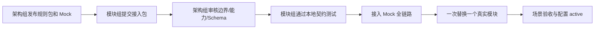

# 架构组交付总索引

**版本：** v0.1  
**日期：** 2026-07-17  
**维护方：** 平台架构组  
**用途：** 作为各层、各模块、测试和配置管理组获取当前规则、提交接入包、进入联调的唯一入口。

## 1. 当前权威顺序

| 优先级 | 文件 | 用途 |
| --- | --- | --- |
| 1 | `AI平台架构框架说明_v2_2_20260716.docx` | 三层、十三引擎、十五模块、层接口、能力字典、典型案例。 |
| 2 | `层间交互逻辑图_v2_6_20260716.html` | 当前阶段建设范围和图形化调用关系。 |
| 3 | `v2_2架构冲突解决与落地决议_v0_1_20260716.md` | 确认、配置、数据和权限的冲突裁决。 |
| 4 | `架构基线与模块接入推进规范_v0_1_20260715.md` | 模块接入门禁和文档优先级。 |

低优先级文件与以上文件冲突时，以高优先级文件为准。`资料归档`、旧 v2.1 图、旧实施计划仅作来源/历史参考。

## 2. 给所有组的规则包

| 文件 | 各组使用目的 |
| --- | --- |
| `平台层间通信与权限协议_v0_4_20260715.md` | 公共信封、回复、权限、动作、数据引用、错误码。 |
| `层接口对内通道设计与模块接入规范_v0_1_20260716.md` | 对外通道/对内通道、能力登记、服务接入和网络边界。 |
| `数据流转_对接与通信交互规范_v0_1_20260717.md` | 数据分类、取数/存数、外部系统、引用和数据权限。 |
| `完整任务推进与持续运行机制_v0_1_20260716.md` | 状态、回调、超时、恢复和持续推进。 |
| `平台总体架构与小组边界规范_v0_2_20260715.md` | 各层、各模块的职责与禁止事项。 |
| `意图分析引擎_通信与联调规范_v0_1_20260715.md` | 自然语言、补问、意图确认和结构化命令。 |
| `第一阶段最小演示链路_架构实施设计_v0_1_20260715.md` | 第一阶段样板链路与 Mock 替换边界。 |

## 3. 图与场景材料

| 文件/目录 | 用途 |
| --- | --- |
| `平台运行总逻辑图与真实场景_v0_1_20260716.md` | 模块级控制、调用、数据和回调图。 |
| `通用十大场景演示\` | 十大场景界面/演示材料。 |
| `场景界面_场景一专家能力平民化_付盛贤_v0_5_20260716.html` | v2.2 案例一发起人视角。 |
| `场景界面_场景一专家能力平民化_李志刚经验推广_v0_2_20260716.html` | v2.2 案例一推广/授权视角。 |

## 4. 架构组交付，不是只发文档

架构组需要交付并持续维护以下五类公共能力：

```text
1. 规则：基线、边界、协议、状态、权限、数据和配置规则。
2. 模板：服务登记、能力认领、输入输出 Schema、回调、测试和 README 模板。
3. 公共基座：层接口控制、对内通道 SDK、追踪、审计、权限适配、Mock。
4. 验证工具：契约测试、权限测试、幂等/回调测试、链路追踪查询。
5. 治理：能力字典、能力登记表、配置变更门禁、版本兼容和架构裁决。
```

## 5. 各组接入推进流程



### 5.1 模块组必须提交的接入包

```text
service-manifest.json
capability-claims.json
input/output/callback Schema
success / accepted / failed 样例
权限动作、数据范围、超时、幂等、回调说明
契约、权限、异常、幂等测试
README：负责什么、不负责什么、允许调用方、负责人、版本
```

### 5.2 五道门

1. **边界门：** 职责、禁止事项、允许调用方、数据责任明确。
2. **能力门：** 已认领能力字典编号，能力登记表字段完整。
3. **契约门：** Schema、三种回复、权限、幂等、回调测试通过。
4. **链路门：** 用 Mock 跑通同一 `trace_id` 的完整链路。
5. **上线门：** 每次只替换一个真实模块，场景验收后才能 `active`。

任一门未通过，模块只能是 `draft` 或 `mock`，不得接入真实业务数据、旧系统写入或正式工作台。

## 6. 分阶段实施提醒

- **第一阶段：** 以 v2.6 的框架验证范围为准。流程执行引擎尚未上线，涉及单任务直投的阶段性规则必须单独登记，不得扩展为通用多引擎编排。
- **第二阶段：** 流程执行、能力字典和能力登记表上线后，多步骤任务统一由流程执行编排和选派。
- **第三、四阶段：** 按 v2.6 启用新增引擎和模块；未到阶段的能力保持 `planned`，不能被登记为 active。

## 7. 架构组每周维护清单

- 更新能力字典、能力登记表和变更记录。
- 审核新增模块的接入包和测试证据。
- 维护 SDK、Mock、错误码、测试基线和阶段性例外。
- 检查越层调用、直连、共享存储、权限绕过和无追踪请求。
- 对跨组边界争议发布书面裁决，并更新受影响规则。
