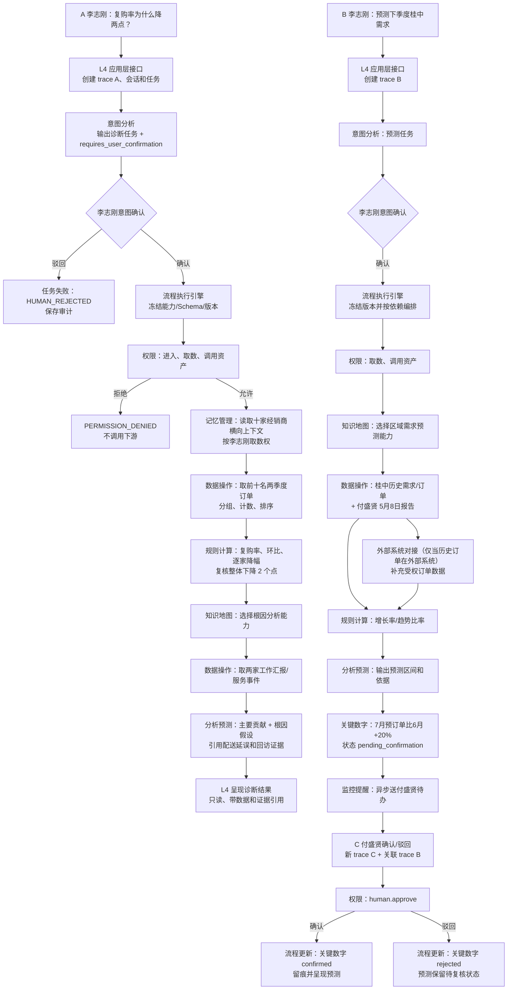

# 案例九：经营诊断与预测联调数据包与逻辑流程图 v0.1

**架构基线**：《AI平台架构框架说明 v3.9》案例九  
**用途**：架构组向业务数据、模块和前后端小组发放的统一联调任务书。  
**场景性质**：被动按需的诊断与预测；除付盛贤确认关键数字外，不写业务数据、不替人作经营决策。

## 1. 统一场景与验收结论

### 1.1 三次独立交互

| 交互 | 发起人 | 固定请求 | 目标 | 是否确认 |
| --- | --- | --- | --- | --- |
| A：经营诊断 | 李志刚 | `为什么六月前十名经销商本季度复购率环比降两个点？` | 复核事实、定位两家主要经销商、给出共同原因 | 李志刚意图确认一次 |
| B：需求预测 | 李志刚 | `按现在的走势，预测下季度桂中的需求。` | 形成预测区间与依据 | 李志刚意图确认一次 |
| C：关键数字确认 | 付盛贤 | 对 `7月预订单比6月增加20%` 确认或驳回 | 使关键数字成为已确认或被拒绝状态 | 付盛贤第三方确认一次 |

每次交互各自有 `trace_id`；B 与 C 必须带同一业务关联号或 `parent_trace_id`，使平台可追溯“哪项预测、哪个数字、由谁确认”。

### 1.2 必须满足的验收事实

数据提供方应准备能稳定复现以下事实的数据，具体金额和订单编号可脱敏：

1. 六月前十名经销商整体的本季度复购率，比上一季度低 **2 个百分点**。
2. 该 2 个百分点的主要降幅由 **两家指定经销商**贡献；其余八家不应成为主要原因。
3. 两家经销商对应期间的工作汇报都包含可被追溯的事实：**配送延误集中**、**回访未跟上**。
4. 桂中历史需求与订单走势支持输出“下季度需求预测区间”，不得输出无依据的单一确定值。
5. 预测中的 `7月预订单较6月增加20%` 初始状态为 `waiting_human` / `pending_confirmation`；只有付盛贤确认后状态才为 `confirmed`。

## 2. 你需要提供的原始数据包

所有文件使用 UTF-8 CSV、XLSX 或经确认的系统导出格式；不得提供生产密钥、完整个人联系方式或无关业务数据。每个文件必须带 `tenant_id`、数据责任方、来源系统和导出时间。

### 2.1 必交数据文件

| 文件建议名 | 用途 | 最少字段 | 数据范围 |
| --- | --- | --- | --- |
| `dealer_quarter_orders` | 复购率、经销商分组与排序 | `tenant_id,dealer_id,dealer_name,order_id,customer_id,order_date,quarter,is_repeat_order,amount,region` | 前十名经销商，上季度和本季度；至少覆盖六月 |
| `dealer_ranking_scope` | 固定“前十名”口径 | `tenant_id,ranking_month,dealer_id,rank,ranking_metric,ranking_value,region` | 六月、桂中或约定经营范围 |
| `dealer_service_events` | 配送延误与回访事实 | `tenant_id,dealer_id,event_id,event_date,event_type,status,delay_days,follow_up_status,source_ref` | 两家主要经销商的相关期间 |
| `work_reports` | 根因和预测依据 | `tenant_id,report_id,author_id,author_name,report_date,region,dealer_id,content,classification,source_ref` | 含付盛贤 5 月 8 日报告；含两家经销商相关报告 |
| `guizhong_demand_history` | 预测输入 | `tenant_id,region,month,product_line,demand_qty,order_qty,revenue,returned_qty,data_source` | 桂中至少连续 12 个月 |
| `july_preorder_evidence` | 20% 关键数字依据 | `tenant_id,region,month,preorder_qty,evidence_type,evidence_ref,owner_id` | 六月基线与七月预订单；可证明 20% 来源 |
| `asset_capability_catalog` | 知识地图选择能力 | `asset_id,asset_type,capability_code,owner_id,share_scope,version,status,description` | 根因分析能力、区域需求预测能力 |
| `identity_permission_snapshot` | 账号、范围、权限 | `actor_id,tenant_id,position_id,project_id,action,resource_type,resource_scope,effect` | 李志刚、付盛贤、无权限对照账号 |

### 2.2 业务方需要确认的口径

| 项目 | 必须给出 | 验收使用方式 |
| --- | --- | --- |
| 前十名定义 | 排名指标、排名月份、并列处理 | 数据操作引擎固定筛选范围 |
| 复购定义 | 同一客户、同一经销商、跨期或期内的重复规则 | 规则计算引擎的分子、分母和去重规则 |
| 本季度/上季度 | 自然季度或财务季度、具体起止日 | 防止数据模块自行猜测日期范围 |
| 两家主要经销商 | `dealer_id` 列表，或可复算的主要贡献阈值 | 分析预测结果的可判定断言 |
| 配送延误 | 延误的阈值、事件类型和状态 | 根因事实引用的过滤规则 |
| 回访未跟上 | 未完成、超期或缺失的判断口径 | 根因事实引用的过滤规则 |
| 桂中范围 | 地区编码、产品线范围、数据来源 | 预测输入范围 |
| 预测目标 | 需求量、订单量或收入；预测周期 | 预测区间的单位和字段 |
| 20% 依据 | 六月基线、七月预订单来源、允许误差 | 第三方确认卡内容 |

### 2.3 架构组建议提供的脱敏样例数据形态

```csv
tenant_id,dealer_id,quarter,customer_id,is_repeat_order,amount,region
tenant-demo,D001,2026Q1,C1001,true,12000,桂中
tenant-demo,D001,2026Q2,C1001,false,8000,桂中
```

样例只说明结构。实际联调数据必须使“整体降 2 个百分点、两家主要贡献、配送延误和回访问题、20% 待确认”四项结论可复算。

## 3. 各模块收到什么、返回什么

| 模块 | 输入 | 必须返回 | 不得做 |
| --- | --- | --- | --- |
| L4 应用 | 自然语言、账号、Project、会话 | 标准信封、确认卡、任务状态、结果和 trace | 直接访问数据或替用户判权 |
| 意图分析 | 原始语句、受权上下文 | `capability_ids`、任务清单、`requires_user_confirmation` | 直接执行诊断或预测 |
| 流程执行 | 已确认结构化命令 | 冻结版本的节点计划、状态、事件、结果引用 | 自行修改确认要求或跳过权限 |
| 数据操作 | 范围、字段、过滤条件、数据引用 | 受权数据集、分组/排序结果、数据来源引用 | 判定业务权限或直接输出归因 |
| 规则计算 | 复购定义、原始计数、季度范围 | 复购率、环比降幅、逐家降幅、趋势比率和公式版本 | 用模型估算客观数字 |
| 知识地图 | 用户、目标能力、资产范围 | 已选资产 `asset_id/version` 或明确无匹配 | 执行预测/根因业务处理 |
| 分析预测 | 规则结果、报告引用、选定能力 | 两家主要贡献判断、根因假设及证据引用；预测区间及依据 | 将假设写成确定事实 |
| 外部系统对接 | 外部订单查询条件 | 标准化外部数据和来源/时间戳 | 绕过数据和权限审计 |
| 权限管理 | `actor,action,resource,scope` | `allow/deny,decision_id,obligations` | 返回无机器可读错误码的拒绝 |
| 监控提醒 | 确认任务、收件人、业务关联号 | 异步待办、送达状态、通知 trace | 替付盛贤确认 |
| 数据/审计 | 流程、节点、访问、结果引用 | 版本、责任模块、保留期、完整 trace 查询 | 允许模块直连底层库 |

## 4. 模块级逻辑流程图



## 5. 关键验收断言

| 阶段 | 必须通过 | 失败即责任组 |
| --- | --- | --- |
| A 意图确认前 | 未调用数据、规则、分析预测 | L4/意图/流程组 |
| A 客观复核 | 复购率和环比可用原始订单复算；整体为 -2 个百分点 | 数据/规则组 |
| A 根因结果 | 只把两家列为主要贡献，并引用对应工作汇报和服务事件 | 分析预测/数据组 |
| B 预测 | 返回区间、单位、数据范围、能力版本和证据引用 | 分析预测/知识地图/数据组 |
| C 确认前 | 20% 不得标记为事实或用于不可逆动作 | 流程/监控提醒/L4 组 |
| C 确认后 | 只有付盛贤受权确认可改变状态；全程可按 trace 查询 | 权限/流程/数据组 |
| 任一拒绝 | 返回 `error.code,message,retryable,details` | 所有模块组 |

## 6. 发给各组的执行要求

1. 业务方先交付第 2 节数据包和第 2.2 节口径确认表。
2. 架构组为 A、B、C 分别生成固定 `trace_id`、租户、Project、会话和测试账号。
3. 各模块组只实现本模块表中的输入输出；跨模块调用统一由流程执行引擎编排。
4. 每组提交接口样例、错误样例、数据引用、权限 `decision_id` 与自动化报告。
5. 架构组按第 5 节逐项核验；未通过只登记错误码和责任组，不以口头说明放行。

## 7. 原始数据逐字段说明与最小数据量

### 7.1 `dealer_quarter_orders`：订单与复购事实表

| 字段 | 类型 | 含义 | 必填 | 示例 |
| --- | --- | --- | --- | --- |
| `tenant_id` | string | 租户隔离键 | 是 | `tenant-demo` |
| `region` | string | 经营区域 | 是 | `桂中` |
| `dealer_id` | string | 经销商稳定编号 | 是 | `D001` |
| `dealer_name` | string | 脱敏展示名 | 是 | `经销商A` |
| `order_id` | string | 订单唯一编号 | 是 | `O-2026Q2-001` |
| `customer_id` | string | 脱敏客户稳定编号 | 是 | `C001` |
| `order_date` | date | 下单日期 | 是 | `2026-06-18` |
| `quarter` | string | 业务方确认的季度键 | 是 | `2026Q2` |
| `is_repeat_order` | boolean | 按已确认复购口径计算的标记 | 是 | `true` |
| `amount` | decimal | 订单金额，仅用于核对 | 否 | `12000.00` |
| `source_ref` | string | 原系统记录或导出批次引用 | 是 | `erp:order:001` |

**最小量**：10 家经销商 × 2 个季度；每家每季度至少 10 个客户/订单事实。不得仅提交汇总数字，否则无法验证分组、去重和两家主要贡献者。

### 7.2 `dealer_service_events`：配送与回访事实表

| 字段 | 类型 | 说明 |
| --- | --- | --- |
| `event_id` | string | 事件唯一编号 |
| `dealer_id` | string | 必须能关联到两家主要经销商 |
| `event_date` | date | 发生日期，落在诊断期间 |
| `event_type` | enum | `delivery` / `follow_up` |
| `delay_days` | integer | 配送事件必填，延误天数 |
| `follow_up_status` | enum | `completed` / `overdue` / `missing` |
| `status` | enum | 已确认、处理中、取消等来源状态 |
| `source_ref` | string | 来源系统或工作汇报的可追溯引用 |

**固定验收要求**：两家主要经销商均至少有 1 条延误事件与 1 条超期/缺失回访事件；其他经销商不能大量出现同类事件而导致根因结论失真。

### 7.3 `work_reports`：工作汇报与证据表

| 字段 | 类型 | 说明 |
| --- | --- | --- |
| `report_id` | string | 汇报唯一编号 |
| `author_id` | string | 作者账号；必须含付盛贤 |
| `report_date` | date | 必须含 `2026-05-08` |
| `region` | string | 桂中或对应区域 |
| `dealer_id` | string/null | 可关联经销商；区域汇报可为空 |
| `content` | text | 原文或经授权的脱敏正文 |
| `classification` | enum | 数据分类，如 `internal` |
| `source_ref` | string | 文件/记录版本引用 |

付盛贤 5 月 8 日报告必须能说明至少一项预测依据，例如区域需求变化、预订单线索、库存或一线客户反馈。分析预测引擎只能引用该报告实际存在的内容。

### 7.4 `guizhong_demand_history`：预测输入表

| 字段 | 类型 | 说明 |
| --- | --- | --- |
| `month` | string | `YYYY-MM`，连续至少 12 个月 |
| `region` | string | 固定为桂中 |
| `product_line` | string | 产品线；未指定时使用 `ALL` |
| `demand_qty` | decimal | 需求量，预测目标或核心特征 |
| `order_qty` | decimal | 历史订单量 |
| `revenue` | decimal | 可选辅助特征 |
| `returned_qty` | decimal | 可选退货特征 |
| `data_source` | enum | `platform` / `external_system` |
| `source_ref` | string | 数据批次、报表或接口引用 |

不得把预测期的数据混入训练/输入数据。预测期为业务方定义的“下季度”，其起止月必须写入本次请求 `context`。

## 8. 固定计算口径与预期结果文件

### 8.1 复购率和环比降幅

业务方需确认最终口径；联调默认采用如下可复算定义：

```text
季度复购客户数 = 该季度内存在 is_repeat_order=true 的去重 customer_id 数量
季度活跃客户数 = 该季度内存在任一有效订单的去重 customer_id 数量
复购率 = 季度复购客户数 / 季度活跃客户数 × 100%
环比变化（百分点） = 本季度复购率 - 上季度复购率
```

验收文件 `expected_case9_results.json` 必须由数据提供方签字确认，至少包含：

```json
{
  "scope": {"region": "桂中", "ranking_month": "2026-06", "quarters": ["2026Q1", "2026Q2"]},
  "overall": {"q1_repeat_rate": 0.00, "q2_repeat_rate": 0.00, "change_percentage_points": -2.0},
  "major_contributor_dealer_ids": ["D001", "D002"],
  "root_cause_evidence": {
    "D001": ["event-ref-1", "report-ref-1"],
    "D002": ["event-ref-2", "report-ref-2"]
  },
  "forecast": {"region": "桂中", "period": "2026Q3", "unit": "需求量"},
  "critical_number": {"metric": "july_preorder_growth", "baseline_month": "2026-06", "target_month": "2026-07", "value": 0.20, "confirmation_actor_id": "fu-shengxian"}
}
```

其中 `q1_repeat_rate`、`q2_repeat_rate` 由业务方填写真实期望值；架构组只要求其差值为 `-2.0` 个百分点。分析预测结论必须引用 `root_cause_evidence`，但不得把“配送延误、回访未跟上”描述为未经证据支持的确定事实。

## 9. 三段接口与状态执行表

### 9.1 A 段：诊断

| 节点 | 调用能力 | 输入最小字段 | 输出/状态 | 数据与权限要求 |
| --- | --- | --- | --- | --- |
| A1 | `intent.analyze` | `utterance,actor,project_id,conversation_id` | 诊断任务、`requires_user_confirmation=true` | 进入业务引擎层判权 |
| A2 | `confirmation.decision` | `confirmation_id,decision=confirm` | 任务进入 `running` | 只能由李志刚确认 |
| A3 | `memory.context.read` | 前十名经销商的横向上下文范围 | 受权上下文引用 | v3.9 要求意图解析时读取；`data.read` 判权 |
| A4 | `data.search` | 前十范围、两季度、订单字段 | 受权订单引用 | `data.read`，返回数据版本/来源 |
| A5 | `rule.calculate` | 复购公式、分组结果 | 整体和逐家复购率/降幅 | 公式版本、输入数据引用 |
| A6 | `knowledge_map.select_resource` | `capability=root_cause_analysis,actor` | `asset_id/version` 或 no-match | `asset.use` 判权 |
| A7 | `data.search` | 两家经销商、诊断期间、事件/报告 | 事件和报告引用 | `data.read` 判权 |
| A8 | `analysis.business_metric` | A5 数字、A6 资产、A7 证据引用 | 两家主要贡献、根因假设、证据引用 | 结果标注 `analysis_type=diagnostic` |
| A9 | `data.persist` | 流程/节点/访问决策/结果引用 | `succeeded` | 仅存运行审计与结果引用，不写入或改变业务数据 |

### 9.2 B 段：预测

| 节点 | 调用能力 | 输入最小字段 | 输出/状态 | 数据与权限要求 |
| --- | --- | --- | --- | --- |
| B1-B2 | `intent.analyze` + 确认 | 预测语句、桂中、下季度 | 预测结构化命令 | 李志刚确认一次 |
| B3 | `knowledge_map.select_resource` | `capability=regional_demand_forecast` | 可用预测资产或降级说明 | `asset.use` |
| B4 | `data.search` | 桂中 12 月历史数据、付盛贤报告引用 | 受权数据引用 | `data.read` |
| B5 | `external.api.call` | 外部订单范围（如有） | 标准化外部数据/来源时间 | 外部接口和取数权限 |
| B6 | `rule.calculate` | 月度序列、增长率公式 | 趋势/增长率结果 | 不得由模型心算 |
| B7 | `analysis.business_metric` | B3-B6 引用和预测期 | `[lower,upper]` 区间、置信/依据 | 输出不得是单点结论 |
| B8 | `human.task.create` | 20% 关键数字、证据、收件人 | `waiting_human` | 生成付盛贤待办 |

### 9.3 C 段：第三方确认

| 节点 | 调用能力 | 输入最小字段 | 输出/状态 | 权限要求 |
| --- | --- | --- | --- | --- |
| C1 | 通知送达 | `task_id,recipient=fu-shengxian,trace B` | `delivered` 或明确失败 | 收件人范围校验 |
| C2 | `confirmation.decision` | `decision=confirm/reject,reason` | 关键数字状态变化 | `human.approve` + 数字范围确认权 |
| C3 | `data.persist` | 决策人、时间、理由、decision_id | 审计记录与预测版本 | 不得覆盖原始预测 |
| C4 | 结果通知 | B 预测关联号、确认状态 | 李志刚工作台更新 | 只呈现受权摘要 |

## 10. 关键消息样例

### 10.1 A 段确认后的流程命令

```json
{
  "trace_id": "trace-a-diagnosis",
  "parent_request_id": "intent-a-001",
  "source": {"layer": "business_application", "module": "application-gateway"},
  "target": {"layer": "business_engine", "module": "engine-gateway", "capability": "workflow.execute"},
  "actor": {"actor_id": "li-zhigang", "tenant_id": "tenant-demo", "authenticated": true},
  "context": {"project_id": "guizhong-management", "conversation_id": "c-case9-a", "data_scope": {"region": "桂中"}},
  "request_type": "execute",
  "action": "workflow.execute",
  "payload": {
    "requires_user_confirmation": true,
    "confirmed": true,
    "capability_ids": ["data.search", "rule.calculate", "knowledge_map.select_resource", "analysis.business_metric"],
    "diagnostic_scope": {"ranking_month": "2026-06", "quarters": ["2026Q1", "2026Q2"], "top_n": 10}
  }
}
```

### 10.2 付盛贤确认返回

```json
{
  "status": "success",
  "trace_id": "trace-c-confirmation",
  "data": {
    "business_correlation_id": "case9-forecast-001",
    "critical_number": {"metric": "july_preorder_growth", "value": 0.20, "state": "confirmed"},
    "decision": {"decision_id": "dec-case9-001", "actor_id": "fu-shengxian", "at": "2026-07-24T10:00:00+08:00"}
  },
  "error": null
}
```

## 11. 落库、追踪与保留要求

| 数据类型 | 责任模块 | 必须字段 | 最低保留规则 |
| --- | --- | --- | --- |
| 原始导入数据 | 数据模块 | 数据集、版本、来源、分类、租户、范围 | 按业务数据保留策略 |
| 文件/报告引用 | 对象与数据模块 | `object_id/report_id,hash,version,source_ref` | 至少覆盖本次验收周期 |
| 流程实例 | 流程执行 | `workflow_id,trace_id,state,registry_version,schema_version` | 终态后仍可审计 |
| 节点与事件 | 流程执行/数据模块 | 节点状态、序号、输入/输出引用、时间 | 不得在流程终态前清理 |
| 权限决策 | 权限模块 | `decision_id,actor,action,resource,scope,effect` | 按审计策略保留 |
| 临时数据 | 责任模块登记、数据模块存储 | `trace_id,task_id,ttl,owner_module` | 流程未终态不得删除 |

所有模块的接口记录必须可通过 A、B、C 三个 `trace_id` 查询；B 与 C 的业务关联关系必须可查询。这里的流程、节点、权限决策和接口记录属于平台运行/审计数据，不构成案例九所禁止的“业务数据写入”。

## 12. 分阶段联调顺序

| 批次 | 目标 | 参与组 | 放行条件 |
| --- | --- | --- | --- |
| P0 数据预检 | 数据可导入、口径可复算、账号范围正确 | 数据、权限、架构 | `expected_case9_results.json` 已签字确认 |
| P1 A 诊断 | 复核 -2 点、两家定位、证据引用 | L4、意图、流程、数据、规则、知识地图、分析预测 | 全部数字可复算，未确认不执行 |
| P2 B 预测 | 历史取数、能力选择、预测区间 | L4、流程、数据、外部系统、规则、知识地图、分析预测 | 输出区间和依据；无单点伪结论 |
| P3 C 确认 | 20% 异步送达、确认/驳回、状态回写 | 监控提醒、权限、流程、L4、数据 | 只有付盛贤受权操作可改变状态 |
| P4 异常复测 | 无权限、无能力、外部超时、版本冲突 | 全部相关组 | 返回标准错误，流程可追踪且不越权 |

## 13. 架构组最终放行清单

- [ ] 数据方确认口径和预期结果文件。
- [ ] 所有跨模块调用使用公共信封和 `trace_id`。
- [ ] A、B 的意图确认与 C 的第三方确认严格区分。
- [ ] 每次取数均有权限 `decision_id` 和数据来源引用。
- [ ] 客观数字由规则计算引擎产出并可复算。
- [ ] 根因/预测均标注为分析结果，附依据引用和适用范围。
- [ ] 预测为区间，20% 在确认前不得当作已定事实。
- [ ] 无权限、超时、Schema 不兼容均返回标准错误对象。
- [ ] 流程、节点、事件、权限决策和接口调用可按关联编号完整查询。
