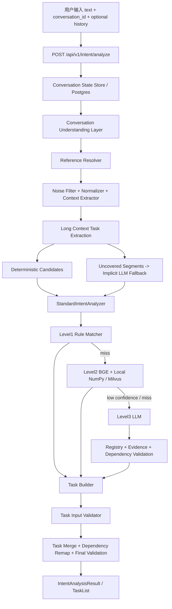

# Intent Analysis Engine 当前项目交接文档

更新时间：2026-07-16  
工作区：`D:\AIProjects\intent-analysis-engine`  
用途：下一次开发会话首先读取本文，快速恢复项目边界、架构、完成状态、验证基线和下一步工作。

## 1. 一页结论

当前项目已经形成完整的自然语言意图分析闭环：

```text
单句 / 多轮对话 / 任意长度文本
  -> Conversation Understanding
  -> Long Context Task Extraction
  -> Level1 Rule Matcher
  -> Level2 BGE + Milvus Semantic Matcher
  -> Level3 LLM Fallback
  -> Task Builder
  -> Input Validator
  -> IntentAnalysisResult / TaskList
```

已支持：规则匹配、BGE语义匹配、多任务拆解、长文本分块、多轮上下文、指代消解、冗余过滤、口语归一化、缺失输入澄清、任务依赖、LLM证据校验和未知能力安全拒绝。

项目只负责“自然语言输入 -> 意图理解 -> 多任务拆解 -> 结构化TaskList输出”，不会调用业务执行引擎、执行具体业务操作、查询真实数据或编排业务流程。当前完整后端回归为 `424 passed, 4 skipped`；本地语义模式下100条复杂对话评测和100条长文本评测均为 `100/100`。生产级benchmark seed已建立300条分层样本，数据集仍应继续替换/扩充为真实脱敏盲测语料。

日常开发和浏览器演示默认使用本地进程：Windows PostgreSQL 16、NumPy本地向量仓库、按需BGE Worker和Vite。Docker保留为Milvus完整集成测试和生产部署选项。

## 2. 项目边界

### 2.1 项目负责

- 理解用户自然语言请求。
- 从单句、对话和长文本中抽取明确任务。
- 拆解多动作请求并生成依赖关系。
- 识别 `task_type`。
- 使用Function Registry确认 `task_type` 是否存在，并读取任务描述和 `required_inputs` 约束。
- 输出 `task_description`、`action`、`object`、输入状态和依赖关系。
- 检查 `required_inputs`，生成 `missing_inputs`。
- 缺少关键输入时生成澄清问题。
- 输出统一 `IntentAnalysisResult` / TaskList。

### 2.2 项目不负责

- 不开发11个下游业务执行引擎。
- 不查询真实业务数据。
- 不执行计算、审批、写入、生成凭证等业务动作。
- 不调用业务执行引擎。
- 不进行业务流程编排。
- 不默认数据来源、统计范围、规则政策或流程参数。
- 不允许BGE或LLM绕过Input Validator。

`engine_code` / `target_engine` 不再出现在最终TaskList中；Function Registry 不再代表可调用执行引擎。

## 3. 不可破坏的关键决策

1. **TaskList契约只表达任务结构**  
   对外任务字段为 `task_id`、`task_type`、`task_description`、`action`、`object`、`required_inputs`、`missing_inputs`、`dependencies`、`confidence`；LLM证据只存在内部协议和debug。

2. **Function Registry只做任务类型约束**  
   Registry只用于确认 `task_type` 存在、约束 `required_inputs`、提供任务描述；禁止根据登记库直接执行任务。

3. **Level1规则优先，BGE不替代规则**  
   匹配顺序固定为 Rule -> Semantic -> LLM -> clarification fallback。

4. **所有任务最终经过Input Validator**  
   Rule、BGE和LLM都不能直接返回未经校验的最终任务。

5. **不默认、不补全、不猜测**  
   只有用户原文或明确对话历史中的信息可以登记为已提供输入。

6. **背景和业务对象不是任务**  
   只有明确动作，或经受控隐式语义抽取确认的请求，才能生成任务。

7. **未知能力安全拒绝**  
   未注册task_type、低置信度、缺少证据或依赖非法时返回空任务并澄清，不强行匹配最近能力。

8. **原文与工作副本分离**  
   `original_text`保存用户原话；归一化文本、证据和分段仅用于内部分析及debug。

9. **本地模型服务只用于演示兼容**  
   `local-model-service`是确定性OpenAI兼容模拟服务，不是真实BGE或真实LLM部署。

10. **所有Python命令使用项目虚拟环境**  
    统一使用 `.venv\Scripts\python.exe`，禁止调用系统Python 3.8。

## 4. 整体架构



### 4.1 Conversation Understanding

位置：`backend/app/services/conversation_understanding/`

- `conversation_parser.py`：入口编排、分段、任务合并、显式输入增强。
- `context_extractor.py`：提取动作、对象、时间、组织、范围、统计字段和数据来源。
- `noise_filter.py`：过滤礼貌、情绪、催促和无任务背景。
- `reference_resolver.py`：处理“这个、上面的、继续、刚才那个”等指代。
- `state_store.py`：Postgres和内存会话状态抽象。

服务端历史按 `user_id + conversation_id` 隔离，默认读取最近20条；调用方仍可显式传入 `history`。

### 4.2 Long Context Task Extraction

位置：`backend/app/services/task_extraction/`

- `long_text_parser.py`：按句子边界分块，保存字符偏移。
- `task_segmenter.py`：区分背景、目标、动作、约束和补充说明。
- `intent_extractor.py`：动作与业务对象候选发现。
- `global_negation_resolver.py`：支持“不考虑、暂时不用、先不要、取消、以后再做、不需要”等跨句否定，后文可撤销前文候选任务。
- `task_consolidator.py`：合并销售经营分析、原因分析、报告生成、提成计算、销售数据整理等语义重复任务，并通过 `merged_sources` 保留子目标。
- `task_merger.py`：跨块去重、重复表达合并和依赖推导。

2026-07-16长文本优化已覆盖：全局否定、Task Merge、动作-对象绑定、输入状态 `provided/missing/uncertain/conflict`、基于未解决输入的澄清问题生成，以及当前年度经营复盘长文本失败案例回归。

默认分块：2000字符，重叠200字符。长度分类：

```text
short:  < 1000
medium: 1000-10000
long:   > 10000
```

API和抽取器当前没有字符硬上限；已验证20K、50K和100K字符，任务位于开头、中间和结尾时均未丢失。生产环境仍应增加请求上限、超时和并发保护。

### 4.3 Semantic Safety Fallback

确定性抽取后，根据字符范围找出未覆盖片段，每批最多8000字符进入隐式LLM候选抽取。显式候选和隐式候选按原文位置合并，再进入现有Analyzer。

Level3每个任务必须提供：

```json
{
  "task_index": 0,
  "evidence_span": "用户原文中的连续片段"
}
```

进入TaskList前检查：

- `task_type`已注册。
- Function Registry仅用于确认 `task_type` 存在，并提供任务描述与 `required_inputs` 约束。
- 证据数量与任务数量一致。
- 证据是用户输入中的连续子串。
- 依赖只引用本结果任务，且不存在自依赖。
- LLM置信度达到阈值。

任一任务失败时拒绝整个Level3任务列表。

### 4.4 Rule / BGE / LLM

- Level1：高精度确定性操作规则和多任务拆解。
- Level2：默认模型名 `BAAI/bge-base-zh-v1.5`，Milvus collection为 `intent_capability_vectors`。
- Level3：通过 `backend/app/services/model_gateway/` 统一接入大模型，处理规则和BGE都不能可靠决定的复杂请求。
- Model Gateway当前支持 `mock`、`deepseek`、`openai` provider；业务链路只能调用 `ModelGateway`，不能直接调用具体厂商Provider。
- 所有LLM输出必须经过 `LLMResponseContractValidator` 代码级契约校验，自动修正missing_inputs澄清、报告依赖和数据整理/分析合并等问题。
- BGE命中后仍由Task Builder和Input Validator处理。
- BGE高置信度结果目前不会进入LLM证据校验，这是现阶段已知风险，需要通过盲测校准阈值和拒绝区间。

### 4.5 Native Semantic Runtime

- 本地模式使用 `.runtime/intent_capability_vectors.npz`，26条768维float32能力向量仅81,413字节。
- BGE运行在独立localhost Worker（默认端口8011），首次Level2请求按需启动。
- 默认 `BGE_KEEP_WARM=false`，空闲60秒后Worker退出，Windows完整回收模型内存。
- 批量评测可使用 `BGE_KEEP_WARM=true` 避免重复冷启动。
- Docker模式继续使用进程内BGE和Milvus，不改变生产集成路径。

## 5. 统一API契约

### 5.1 请求

```json
{
  "text": "那再看看利润情况",
  "user_id": "user-001",
  "conversation_id": "conversation-001",
  "history": [
    {"role": "user", "text": "帮我分析销售数据"}
  ],
  "debug": false
}
```

单轮请求只传 `text` 仍然兼容。

### 5.2 响应核心

```json
{
  "tasks": [
    {
      "task_id": "",
      "task_type": "",
      "task_description": "",
      "action": "",
      "object": "",
      "required_inputs": [],
      "missing_inputs": [],
      "dependencies": [],
      "confidence": 0.0
    }
  ],
  "clarification_required": false,
  "clarification_questions": []
}
```

API：

```text
POST /api/v1/intent/analyze
GET  /api/v1/intent/history
```

`debug=true`时可查看Rule、BGE候选、Level3校验、输入校验、长文本分段、隐式候选和最终决策；正常API响应不包含这些调试信息。

## 6. 任务类型登记库

Function Registry当前只作为只读任务类型目录使用，不再表示可调用的执行引擎，也不参与业务调用。

| 任务能力域 | 典型task_type | 登记库作用 |
| --- | --- | --- |
| 文档/表格解析 | `DOCUMENT_TABLE_PARSE`、`FILE_STRUCTURE_EXTRACT` | 约束任务类型与文件类输入 |
| 外部数据获取/提交意图 | `EXTERNAL_DATA_FETCH`、`EXTERNAL_SYSTEM_SUBMIT` | 只识别任务，不连接外部系统 |
| 数据整理/汇总/筛选 | `DATA_QUERY_FETCH`、`DATA_FILTER`、`DATA_AGGREGATION_SUMMARY` | 提供数据源、操作类型等输入约束 |
| 规则计算 | `RULE_CALCULATION_GENERAL`、`RULE_CALCULATION_COMMISSION` | 识别计算任务和所需规则/依据 |
| 分析预测 | `DATA_ANALYSIS_PROBLEM`、`DATA_ANALYSIS_YOY`、`DATA_ANALYSIS_FORECAST` | 识别分析对象和分析方法 |
| 知识问答 | `QUESTION_ANSWER` | 识别问答任务和问题输入 |
| 文档/内容生成 | `DOCUMENT_GENERATE`、`CONTENT_GENERATE`、`IMPROVEMENT_PLAN_GENERATE` | 识别输出主题和内容类型 |
| 多媒体生成 | `MULTIMEDIA_GENERATE` | 识别媒体类型和主题 |
| 流程办理意图 | `PROCESS_HANDLE`、`WORKFLOW_START` | 只结构化流程类任务，不编排流程 |
| 监控提醒意图 | `MONITORING_REMINDER` | 只结构化监控/提醒需求，不启动提醒 |
| 数字资产意图 | `DIGITAL_ASSET_ACCRUAL_VOUCHER` | 只识别凭证/单据类任务，不创建资产 |

完整能力定义和 `required_inputs` 位于 `backend/app/config/semantic_capabilities.yaml`。

## 7. 已完成部分

### 7.1 核心意图引擎

- 统一 `IntentAnalysisResult` 和 `TaskItem`。
- Rule、BGE、LLM三级识别链路。
- 规则优先级和业务主题/动作边界。
- Task Builder和统一Input Validator。
- 缺失输入澄清和validator来源debug。
- 任务类型登记库，只约束 `task_type`、任务描述和 `required_inputs`。

### 7.2 真实语义能力基础设施

- Embedding Provider抽象。
- 默认BGE模型配置。
- Milvus能力向量collection和初始化脚本。
- NumPy本地能力向量仓库和初始化脚本。
- 独立BGE Worker、按需启动、空闲退出和常驻模式开关。
- YAML语义能力库，包含描述、examples、keywords和required_inputs。
- 可替换模型服务接口。

注意：代码支持真实模型服务，但当前仓库自带的 `local-model-service` 仍是演示模拟实现。

### 7.3 对话和长文本

- 多轮history和Postgres会话状态。
- 指代消解、噪声过滤和口语归一化。
- 多任务拆解、任务合并和依赖重映射。
- 100K字符容量验证。
- 显式任务和模板外隐式任务混合识别。
- 长文本年度经营复盘用例已稳定输出5个任务：整理销售数据、分析销售经营情况、分析销售下降原因、生成经营分析报告、计算销售提成；不再生成已被“目前不用考虑”否定的自动提醒任务。
- 旧100条长文本集中“客户投诉整理”和“双文档解析/字段提取”回归已修复，`semantic-mode off` 和 `semantic-mode local` 均为 `100/100`。

### 7.4 LLM安全

- Function Registry强校验。
- 原文证据校验。
- 引擎映射校验。
- 依赖合法性校验。
- 低置信度拒绝。
- 未知能力空任务澄清。
- 新旧LLM Schema使用独立提示词，避免兼容冲突。

### 7.5 评测体系

- `evaluation/dataset/intent_test_dataset.json`：基础意图评测。
- `evaluation/conversation_dataset.json`：100条复杂对话评测。
- `evaluation/long_text_dataset.json`：100条长文本评测。
- `evaluation/llm_regression/sales_operation_analysis_case.json`：经营分析长文本LLM回归门槛，覆盖5个必需任务、6个禁止任务、4类澄清主题和依赖正确性。
- `evaluation/benchmark/`：生产级benchmark体系，含train/validation/blind_test、metrics和runner；blind_test禁止参与规则开发。
- `evaluation/error_analysis/`：benchmark失败分类、before/after指标比较和优化报告。
- `evaluation/regression_cases.json`：历史失败回归。
- `evaluation_runner.py`、`conversation_evaluation_runner.py`、`long_text_evaluation_runner.py`。
- 安全专项测试覆盖未注册任务、引擎错配、伪造证据、未知能力和混合隐式任务。

### 7.6 可视化和部署

- React/Vite测试控制台。
- 输入框初始为空，不显示离线模拟输出和判断路径。
- 浏览器通过同源 `/api/...` 和Vite proxy访问backend，避免CORS问题。
- Docker开发profiles降低默认资源占用。
- Backend Dockerfile启用 `PIP_NO_CACHE_DIR=1`，使用CPU Torch并优化缓存层。
- 离线简易演示位于 `offline-demo/`。
- `scripts/start-local.ps1` / `stop-local.ps1` 提供无Docker的一键启停。

## 8. 当前验证基线

Python：

```text
Python 3.12.7
```

后端完整测试：

```text
424 passed, 4 skipped, 2 warnings
```

复杂对话评测：

```text
semantic-mode local: 100/100
task_type accuracy: 100%
clarification accuracy: 100%
decomposition accuracy: 100%
```

长文本评测：

```text
semantic-mode off: 100/100
semantic-mode local: 100/100
candidate recall: 100%
task_type accuracy: 100%
clarification accuracy: 100%
decomposition accuracy: 100%
```

容量测试：

```text
20,000 characters: passed
50,000 characters: passed
100,000 characters: passed
```

本地真实Level2验证：

```text
query: 最近经营情况怎么样
analysis_level: 2
task_type: DATA_ANALYSIS_PROBLEM
selected_by: semantic
first-load latency: 17.15 seconds
BGE worker memory: about 747 MiB
idle release: worker stopped after 60 seconds; backend remained about 99 MiB
local vector file: 81,413 bytes / 26 records / 768 dimensions
```

这些结果是开发回归基线，不是独立盲测结论。

## 9. 重要配置

```env
MODEL_API_URL=http://local-model-service:8001/v1
EMBEDDING_MODEL_NAME=BAAI/bge-base-zh-v1.5
BGE_EMBEDDING_DIMENSION=768
INTENT_CAPABILITY_COLLECTION=intent_capability_vectors
VECTOR_BACKEND=local                    # Docker: milvus
EMBEDDING_RUNTIME=worker                # Docker: in_process
BGE_WORKER_HOST=127.0.0.1
BGE_WORKER_PORT=8011
BGE_KEEP_WARM=false                     # batch evaluation: true
BGE_IDLE_TIMEOUT_SECONDS=60
LLM_PROVIDER=mock                       # deepseek / openai / mock
LLM_BASE_URL=
LLM_API_KEY=
LLM_MODEL=mock-llm
LLM_TIMEOUT_SECONDS=120
SEMANTIC_THRESHOLD=0.50
LLM_CONFIDENCE_THRESHOLD=0.70
IMPLICIT_TASK_CONFIDENCE_THRESHOLD=0.70
IMPLICIT_FALLBACK_BATCH_CHARACTERS=8000
CONVERSATION_HISTORY_LIMIT=20
LONG_TEXT_CHUNK_SIZE=2000
LONG_TEXT_CHUNK_OVERLAP=200
LONG_TEXT_ACTIVATION_LENGTH=120
LONG_TEXT_ACTIVATION_SENTENCES=3
```

阈值应使用未来独立盲测集重新校准。

## 10. 数据库状态

Alembic迁移链：

```text
20260709_0001  创建Intent Engine基础表
  -> 20260713_0002  创建conversation_message
  -> 20260713_0003  写入任务类型登记数据
```

最新revision：`20260713_0003`。

## 11. 本地默认与Docker集成模式

日常开发和浏览器演示：

```powershell
.\scripts\start-local.ps1
```

批量评测时保持BGE常驻：

```powershell
.\scripts\start-local.ps1 -KeepBGEWarm
```

停止本地进程和BGE Worker：

```powershell
.\scripts\stop-local.ps1
```

本地入口与Docker入口相同：

```text
Frontend: http://127.0.0.1:5173/
Backend:  http://127.0.0.1:8000/
API:      http://127.0.0.1:8000/api/v1/intent/analyze
```

Docker仅用于完整集成和生产部署。默认只启动backend和Postgres：

默认只启动backend和Postgres：

```powershell
docker compose up -d --build
```

增加Milvus、etcd和MinIO：

```powershell
docker compose --profile semantic up -d --build
```

增加本地演示模型：

```powershell
docker compose --profile llm up -d --build
```

增加前端：

```powershell
docker compose --profile frontend up -d --build
```

完整演示栈：

```powershell
docker compose --profile semantic --profile llm --profile frontend up -d --build
```

入口：

```text
Frontend: http://127.0.0.1:5173/
Backend:  http://127.0.0.1:8000/
API:      http://127.0.0.1:8000/api/v1/intent/analyze
```

当前状态：本地PostgreSQL、backend和Vite已验证并运行；Docker Engine不需要为日常开发启动。

Milvus启动后初始化能力向量：

```powershell
docker compose --profile semantic exec -T backend python -m scripts.init_intent_capability_vectors
```

如果使用真实BGE或切换Embedding模型，必须重新生成 `intent_capability_vectors`。

本地向量初始化：

```powershell
$env:PYTHONPATH='backend'
.venv\Scripts\python.exe -m scripts.init_local_intent_capability_vectors
```

## 12. 验证命令

确认Python：

```powershell
.venv\Scripts\python.exe --version
```

完整后端回归：

```powershell
$env:PYTHONPATH='backend'
.venv\Scripts\python.exe -m pytest tests\backend -q -p no:cacheprovider
```

本地语义运行时专项：

```powershell
$env:PYTHONPATH='backend'
.venv\Scripts\python.exe -m pytest tests\backend\test_local_semantic_runtime.py -q -p no:cacheprovider
```

复杂对话评测：

```powershell
$env:PYTHONPATH='backend'
.venv\Scripts\python.exe conversation_evaluation_runner.py --semantic-mode local --llm-mode off --output evaluation\conversation_report.json
```

长文本评测：

```powershell
$env:PYTHONPATH='backend'
.venv\Scripts\python.exe long_text_evaluation_runner.py --semantic-mode local --llm-mode off --output evaluation\long_text_report.json
```

安全专项测试：

```powershell
$env:PYTHONPATH='backend'
.venv\Scripts\python.exe -m pytest tests\backend\test_semantic_safety_fallback.py -q -p no:cacheprovider
```

## 13. 重要文件修改记录

| 文件/目录 | 当前职责或重要修改 |
| --- | --- |
| `backend/app/schemas/intent_analysis.py` | 统一TaskList契约；LLM证据使用PrivateAttr，不进入响应Schema |
| `backend/app/schemas/intent_http.py` | 支持 `text`、`user_id`、`conversation_id`、`history`、`debug` |
| `backend/app/api/routes/intent.py` | 统一在线入口；按配置注入本地/Milvus向量仓库、BGE、LLM和会话状态 |
| `backend/app/services/intent_analysis_engine/analyzer.py` | Rule -> BGE -> LLM主链路；Level3安全校验和debug |
| `backend/app/services/intent_analysis_engine/operation_rules.py` | 规则优先级、高精度动作规则、主题边界和监控误判修复 |
| `backend/app/services/intent_analysis_engine/input_validator.py` | 统一required_inputs检查、missing_inputs和澄清问题 |
| `backend/app/services/intent_analysis_engine/registry.py` | 只读任务类型登记库；用于约束task_type、任务描述和required_inputs |
| `backend/app/services/intent_analysis_engine/llm.py` | 证据信封、隐式候选、置信度和证据解析 |
| `backend/app/services/model_gateway/` | 大模型统一接入层；Provider工厂、DeepSeek/OpenAI/Mock Provider、Router、LLM响应契约校验和统一LLM响应 |
| `backend/app/config/semantic_capabilities.yaml` | 配置化语义能力、examples、keywords和required_inputs |
| `backend/app/services/semantic/` | Semantic Matcher、Milvus Repository、NumPy本地向量仓库和运行时工厂 |
| `backend/app/services/embedding/` | 进程内BGE、独立Worker Provider、空闲释放和Embedding抽象 |
| `backend/app/services/conversation_understanding/` | 多轮状态、指代、噪声、归一化、上下文和结果合并 |
| `backend/app/services/task_extraction/` | 长文本分块、语义分段、候选抽取和任务合并 |
| `backend/app/prompts/intent_analysis_prompt.txt` | 新Level3 Registry + evidence协议 |
| `backend/app/prompts/implicit_task_extraction_prompt.txt` | 模板外隐式任务候选抽取协议 |
| `backend/app/prompts/legacy_tasklist_prompt.txt` | 保持旧LLMIntentAnalyzer测试和兼容接口 |
| `backend/app/core/config.py` | 模型、阈值、长文本、隐式兜底和会话配置 |
| `backend/alembic/versions/20260713_0002_*` | 对话状态表 |
| `backend/alembic/versions/20260713_0003_*` | 11个引擎注册数据 |
| `backend/scripts/init_intent_capability_vectors.py` | 初始化 `intent_capability_vectors` |
| `backend/scripts/init_local_intent_capability_vectors.py` | 初始化本地NumPy能力向量文件 |
| `scripts/start-local.ps1` / `stop-local.ps1` | 本地backend、前端、Demo LLM和BGE Worker一键启停 |
| `local-model-service/server.py` | 离线OpenAI兼容演示；未知请求安全拒绝和隐式候选证据 |
| `tests/backend/test_semantic_safety_fallback.py` | Registry、证据、安全拒绝和混合隐式任务回归 |
| `tests/backend/test_long_context_task_extraction.py` | 长文本抽取与背景边界回归 |
| `tests/backend/test_llm_long_text_regression.py` | 经营分析长文本LLM回归指标：任务数量、遗漏任务、错误任务、澄清正确性、依赖正确性 |
| `tests/backend/test_long_context_capacity.py` | 20K/50K/100K容量测试 |
| `evaluation/long_text_dataset.json` | 100条长文本回归集 |
| `evaluation/llm_regression/sales_operation_analysis_case.json` | 长文本LLM回归案例；Prompt修改、模型替换和规则调整后必须通过 |
| `evaluation/conversation_dataset.json` | 100条复杂对话回归集 |
| `long_text_evaluation_runner.py` | 长文本五项指标和错误案例报告 |
| `conversation_evaluation_runner.py` | 复杂对话评测报告 |
| `frontend/src/pages/IntentTestConsole.tsx` | 在线可视化测试控制台 |
| `frontend/vite.config.ts` | `/api`同源代理 |
| `docker-compose.yml` | 默认轻量启动及semantic/llm/frontend profiles |
| `backend/Dockerfile` | CPU依赖、构建缓存和 `PIP_NO_CACHE_DIR=1` |
| `docs/development/NATIVE_DEVELOPMENT.md` | 无Docker本地开发、BGE内存模式和启动命令 |

## 14. 详细设计文档

- `docs/development/INTENT_ANALYSIS_ARCHITECTURE.md`
- `docs/development/CONVERSATION_UNDERSTANDING_ARCHITECTURE.md`
- `docs/development/LONG_CONTEXT_TASK_EXTRACTION.md`
- `docs/development/SEMANTIC_SAFETY_FALLBACK.md`
- `docs/development/DOCKER_DEVELOPMENT_PROFILES.md`
- `docs/development/DOCKER_BUILD_OPTIMIZATION.md`
- `docs/development/NATIVE_DEVELOPMENT.md`

## 15. 已知限制和风险

1. 两套100%评测均为已知开发集，存在过拟合风险。
2. 当前没有独立、保密标签的真实业务盲测集。
3. `local-model-service`不是实际BGE/LLM，不能代表真实模型质量。
4. API没有生产级最大文本长度、超时、chunk数量和并发限制。
5. 隐式任务兜底会对未覆盖片段调用LLM，极长文本可能产生多次模型请求。
6. BGE高置信度误匹配不会进入Level3 evidence校验。
7. 未知语义目前只在debug中可见，尚未建立脱敏审核队列和人工反馈闭环。
8. 真实模型切换后必须重新生成向量并重新校准阈值。
9. BGE本地首次冷启动实测约17秒；空闲释放后下一次Level2会再次产生冷启动。
10. 本地LLM Demo默认不启动；Level3演示需使用 `start-local.ps1 -WithDemoLLM` 或配置真实服务。
11. Docker完整Milvus路径仍需在发布前单独执行集成验证。

## 16. 下一阶段待办

### P0：生产验收前必须完成

1. 建立300-500条真实脱敏盲测集；标签保存在开发仓库之外。
2. 部署真实BGE和真实LLM服务，重新生成Milvus能力向量。
3. 使用盲测结果校准 `SEMANTIC_THRESHOLD`、LLM阈值和拒绝区间。
4. 增加API最大字符数、最大chunk数、模型调用超时和并发保护。
5. 增加长文本无任务、否定、引用他人要求和已完成事项等负样本。

### P1：可维护性和运营闭环

1. 建立未知语义脱敏记录和人工审核队列。
2. 增加任务级Precision、Recall、F1及无任务误报率。
3. 为BGE增加top1/top2差值或拒绝区间，降低近似能力误匹配。
4. 把完整pytest、回归评测和安全评测接入CI质量门禁。
5. 增加处理耗时、chunk数量、候选数量、matcher来源和澄清率指标。

### P2：演示和工程完善

1. 在线控制台增加conversation_id和多轮history测试能力。
2. 增加可选debug详情面板，但默认保持简洁。
3. 统一清理仍保留的旧版 `intent_analyzer` / `llm_engine` 模块前，先确认没有外部调用方。
4. 更新项目根目录启动说明，避免多个历史交接文档产生冲突。

## 17. 下次会话启动顺序

1. 读取本文件。
2. 确认虚拟环境：

```powershell
.venv\Scripts\python.exe --version
```

3. 启动本地开发栈：

```powershell
.\scripts\start-local.ps1
```

4. 如果继续代码开发，先运行安全专项和相关评测。
5. 仅在验证Milvus/容器/生产部署时启动Docker Desktop和完整演示栈。
6. 不修改TaskList契约，不实现业务执行引擎，不用系统Python。

---

下一会话建议首先处理：**真实盲测集设计和生产资源保护**。在盲测完成前，不应把开发集100%表述为生产准确率。
