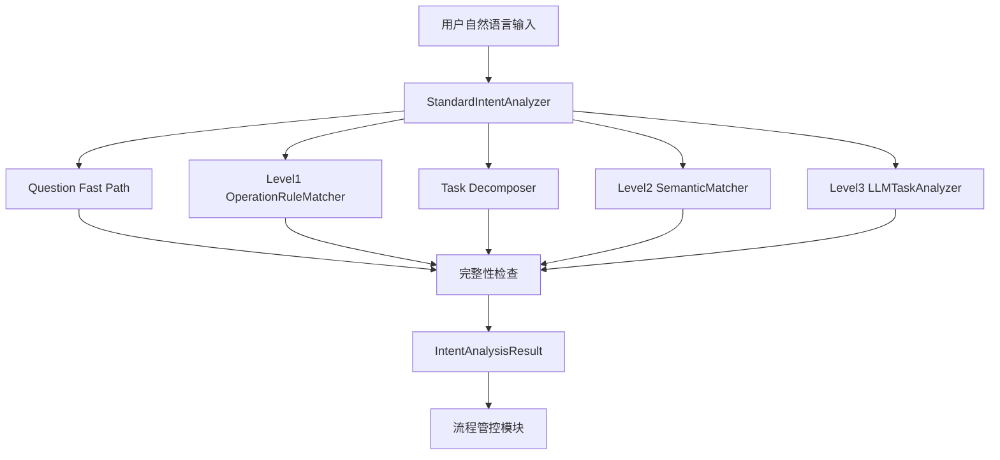

# Intent Analysis Engine 架构说明

更新时间：2026-07-10

## 1. 项目边界

本项目只负责自然语言理解，不开发、不调用任何业务执行引擎。

负责范围：

- 多动作任务拆解
- 任务类型识别
- 目标业务引擎匹配
- 输入信息完整性检查
- 必要时发起澄清
- 输出统一标准任务清单

不负责范围：

- 业务执行逻辑
- 数据查询逻辑
- 数据计算逻辑
- 文件处理逻辑
- 流程执行逻辑
- 图中 11 个下游业务引擎实现

## 2. 核心流程



执行原则：

- 高频标准操作优先由规则层命中，不调用 LLM。
- 简单知识问答走快速路径，不进入复杂拆解。
- 复杂、多动作请求由任务拆解器或 LLM 兜底生成标准 TaskList。
- 信息不足时禁止猜测，返回 `clarification_required=true`。
- debug 中固定标记 `business_execution=not_called`。

## 3. Task Schema

标准输出 schema 定义在 `backend/app/schemas/intent_analysis.py`。

`IntentAnalysisResult`：

```json
{
  "request_id": "",
  "original_text": "",
  "intent_category": "",
  "tasks": [],
  "clarification_required": false,
  "clarification_questions": [],
  "analysis_level": 1,
  "overall_confidence": 0
}
```

`TaskItem`：

```json
{
  "task_id": "",
  "task_name": "",
  "task_type": "",
  "target_engine": "",
  "engine_code": "",
  "required_inputs": [],
  "missing_inputs": [],
  "dependencies": [],
  "execution_order": 1,
  "confidence": 0
}
```

下游流程管控模块只消费该结构，不允许再次解析用户原文。

## 4. 功能登记库设计

登记库实现：

- 代码默认登记库：`backend/app/services/intent_analysis_engine/registry.py`
- 数据库种子：`database/init/002_seed_data.sql`

登记字段：

- `engine_code`
- `engine_name`
- `supported_intents`
- `supported_tasks`
- `required_inputs`
- `legacy_function_codes`
- `description`

当前登记的 11 个下游引擎：

- `ENG_DOCUMENT_TABLE_PARSING`：文档表格解析引擎
- `ENG_EXTERNAL_SYSTEM_CONNECTOR`：外部系统对接引擎
- `ENG_DATA_COLLECTION_AGGREGATION`：数据归集聚合引擎
- `ENG_RULE_CALCULATION`：规则计算引擎
- `ENG_ANALYTICS_FORECASTING`：分析预测引擎
- `ENG_KNOWLEDGE_QA`：知识库问答引擎
- `ENG_CONTENT_OUTPUT`：内容产出引擎
- `ENG_MULTIMEDIA_GENERATION`：多媒体生成引擎
- `ENG_WORKFLOW_EXECUTION`：流程执行引擎
- `ENG_MONITORING_REMINDER`：监控提醒引擎
- `ENG_DIGITAL_ASSET`：数字资产引擎

目标引擎匹配只能从登记库获得，不根据真实数据位置判断。

## 5. 规则匹配设计

规则实现：`backend/app/services/intent_analysis_engine/operation_rules.py`

Level1 覆盖所有登记目标引擎的自然语言规则，不调用业务引擎。

目标引擎规则覆盖：

| engine_code | 目标引擎 | 规则示例 | task_type |
| --- | --- | --- | --- |
| `ENG_DOCUMENT_TABLE_PARSING` | 文档表格解析引擎 | 解析上传的销售明细Excel表格 | `DOCUMENT_TABLE_PARSE` |
| `ENG_EXTERNAL_SYSTEM_CONNECTOR` | 外部系统对接引擎 | 从CRM系统获取客户资料 | `EXTERNAL_DATA_FETCH` |
| `ENG_DATA_COLLECTION_AGGREGATION` | 数据归集聚合引擎 | 按区域汇总本月销售金额 | `DATA_AGGREGATION_SUMMARY` |
| `ENG_RULE_CALCULATION` | 规则计算引擎 | 根据销售提成政策计算上个月销售提成 | `RULE_CALCULATION_COMMISSION` |
| `ENG_ANALYTICS_FORECASTING` | 分析预测引擎 | 预测下季度销售额趋势 | `DATA_ANALYSIS_FORECAST` |
| `ENG_KNOWLEDGE_QA` | 知识库问答引擎 | 公司的报销政策是什么？ | `QUESTION_ANSWER` |
| `ENG_CONTENT_OUTPUT` | 内容产出引擎 | 写一份会议通知 | `CONTENT_GENERATE` |
| `ENG_MULTIMEDIA_GENERATION` | 多媒体生成引擎 | 生成一张新品发布海报 | `MULTIMEDIA_GENERATE` |
| `ENG_WORKFLOW_EXECUTION` | 流程执行引擎 | 发起采购审批流程 | `WORKFLOW_START` |
| `ENG_MONITORING_REMINDER` | 监控提醒引擎 | 库存低于100时提醒我 | `MONITORING_REMINDER` |
| `ENG_DIGITAL_ASSET` | 数字资产引擎 | 根据本月提成计算结果生成计提凭证 | `DIGITAL_ASSET_ACCRUAL_VOUCHER` |

同时保留高频数据操作规则：

- 分类统计
- 分类求和
- 排序
- 筛选
- 汇总
- 透视表
- 同比
- 环比

示例：

输入 `生成销售数据透视表` 直接命中：

- `task_type=DATA_ANALYSIS_PIVOT`
- `engine_code=ENG_DATA_COLLECTION_AGGREGATION`
- `analysis_level=1`
- `level3_result=null`

## 6. 语义分析设计

Level2 保留现有 Embedding + Milvus 能力：

- `backend/app/services/semantic_engine/matcher.py`
- API 依赖仍创建 `SemanticMatcher`
- 命中旧 `function_code` 后映射到新 `engine_code/task_type`

兼容映射：

- `FUNC_REPORT_GENERATION` -> `DOCUMENT_GENERATE` / `ENG_CONTENT_OUTPUT`
- `FUNC_INTELLIGENT_QA` -> `QUESTION_ANSWER` / `ENG_KNOWLEDGE_QA`
- `FUNC_DATA_PROCESSING` -> `DATA_AGGREGATION_SUMMARY` / `ENG_DATA_COLLECTION_AGGREGATION`
- `FUNC_CONTENT_CREATION` -> `CONTENT_GENERATE` / `ENG_CONTENT_OUTPUT`

## 7. 澄清机制设计

澄清实现：`backend/app/services/intent_analysis_engine/clarification.py`

规则：

- 缺少关键信息时不猜测、不默认、不自动补全。
- 缺失项写入 `tasks[].missing_inputs`。
- 面向用户的问题写入 `clarification_questions`。

示例：

输入 `统计销售金额` 返回：

```json
{
  "clarification_required": true,
  "clarification_questions": [
    "请确认统计维度（例如区域、产品、客户）。",
    "请确认统计范围（例如时间范围、组织范围）。"
  ]
}
```

## 8. 新增代码文件

- `backend/app/schemas/intent_analysis.py`
- `backend/app/services/intent_analysis_engine/__init__.py`
- `backend/app/services/intent_analysis_engine/analyzer.py`
- `backend/app/services/intent_analysis_engine/clarification.py`
- `backend/app/services/intent_analysis_engine/decomposer.py`
- `backend/app/services/intent_analysis_engine/fast_path.py`
- `backend/app/services/intent_analysis_engine/llm.py`
- `backend/app/services/intent_analysis_engine/operation_rules.py`
- `backend/app/services/intent_analysis_engine/registry.py`
- `backend/app/services/intent_analysis_engine/task_factory.py`
- `tests/backend/test_intent_analysis_engine_contract.py`

## 9. 测试结果

已在 backend Docker 镜像内运行 5 个契约断言：

```text
contract assertions passed: 5 cases
```

HTTP API 抽测结果：

| 输入 | level | clarification | task_count | engine_codes |
| --- | ---: | --- | ---: | --- |
| 把上个月各区域销售提成算出来，生成计提凭证 | 3 | false | 3 | ENG_DATA_COLLECTION_AGGREGATION, ENG_RULE_CALCULATION, ENG_DIGITAL_ASSET |
| 统计销售金额 | 1 | true | 1 | ENG_DATA_COLLECTION_AGGREGATION |
| 生成销售数据透视表 | 1 | false | 1 | ENG_DATA_COLLECTION_AGGREGATION |
| 公司的报销政策是什么？ | 1 | false | 1 | ENG_KNOWLEDGE_QA |
| 整理客户投诉并生成改进方案 | 3 | false | 3 | ENG_DATA_COLLECTION_AGGREGATION, ENG_ANALYTICS_FORECASTING, ENG_CONTENT_OUTPUT |

新增目标引擎规则覆盖抽测结果：

```text
all 11 target engine rule assertions passed
```

通过 `/api/v1/intent/analyze` 验证：

| 输入 | level | engine_code | task_type | business_execution |
| --- | ---: | --- | --- | --- |
| 解析上传的销售明细Excel表格 | 1 | ENG_DOCUMENT_TABLE_PARSING | DOCUMENT_TABLE_PARSE | not_called |
| 从CRM系统获取客户资料 | 1 | ENG_EXTERNAL_SYSTEM_CONNECTOR | EXTERNAL_DATA_FETCH | not_called |
| 按区域汇总本月销售金额 | 1 | ENG_DATA_COLLECTION_AGGREGATION | DATA_AGGREGATION_SUMMARY | not_called |
| 根据销售提成政策计算上个月销售提成 | 1 | ENG_RULE_CALCULATION | RULE_CALCULATION_COMMISSION | not_called |
| 预测下季度销售额趋势 | 1 | ENG_ANALYTICS_FORECASTING | DATA_ANALYSIS_FORECAST | not_called |
| 公司的报销政策是什么？ | 1 | ENG_KNOWLEDGE_QA | QUESTION_ANSWER | not_called |
| 写一份会议通知 | 1 | ENG_CONTENT_OUTPUT | CONTENT_GENERATE | not_called |
| 生成一张新品发布海报 | 1 | ENG_MULTIMEDIA_GENERATION | MULTIMEDIA_GENERATE | not_called |
| 发起采购审批流程 | 1 | ENG_WORKFLOW_EXECUTION | WORKFLOW_START | not_called |
| 库存低于100时提醒我 | 1 | ENG_MONITORING_REMINDER | MONITORING_REMINDER | not_called |
| 根据本月提成计算结果生成计提凭证 | 1 | ENG_DIGITAL_ASSET | DIGITAL_ASSET_ACCRUAL_VOUCHER | not_called |
